# Towards a platform PBPK-QSP model for ADC to predict toxicity

Antibody-drug-conjugate (ADC) are a rapidly expanding class of anti-cancer drugs. They were developed with the aim to expand the therapeutic index of payloads by employing the targeting specificity of monoclonal antibodies (mAbs) to increase the efficacy of the delivery of potent cytotoxicity agents to malignant cells. Although many ADCs have demonstrated sufficient efficacy, the clinical use of all ADCs leads to substantial toxicity in treated patients. Many ADCs have failed during the clinical development due to their unacceptable toxicity profile. 

Here, we developed a physiologically based pharmacokinetics (PBPK) model to predict both off-target and on-target off-site toxicities of ADCs. The PBPK backbone was adopted from 
[Jones et al., 2019](https://ascpt.onlinelibrary.wiley.com/doi/full/10.1002/psp4.12461), with additional tumor compartment details added based on [Scheuher et al., 2022](https://www.researchsquare.com/article/rs-2371793/v1). 

We demonstrate our model could predict the observed liver and lung toxicity of trastuzumab emtansine (T-DM1), a widely used ADC to treat HER-2-positive breast cancer. Our model also predicted the low hepatotoxicity of trastuzumab deruxtecan (T-Dxd), another HER-2 targeting ADC, and brentuximab vedotin, an ADC used to treat lymphoma. Furthermore, we demonstrate our model could predict the high hepatotoxicity observed in cantuzumab mertansine, an ADC suspended from development. 

In conclusion, the presented model is a step towards a platform PBPK model to predict possible toxicities from ADCs in clinics. The model has potential application to facilitate ADC design, lead candidate selection, and clinical dosing schedule optimization by reducing toxicity. 

# Model development 

The backbone for ADC distribution was based on [Jones et al., 2019](https://ascpt.onlinelibrary.wiley.com/doi/10.1002/psp4.12461), as summarized in the Figure 1 (A). Briefly, once ADC was delivered to plasma, they could go through either FcRn-mediated and FcRn-independent distribution process to go into tissue endothelial cells or tissue interstitium. Plasma ADC could also go into tumor through either vascular exchange or surface exchange ([Shah et al., 2012](https://pubmed.ncbi.nlm.nih.gov/23151991/)). In addition, soluble HER2 (sHER2) in plasma was included in the model (summarized in Figure 1 (C)). The model assumed these sHER2 were synthesized with steady rate. They could be degraded, or bind to either T-DM1 or T-Dxd in the plasma. The sHER2-ADC complex could also be graded. 

The mechanistic model for receptor-mediated ADC uptake and payload release was based on the HER2 dynamics modeled in [Scheuher et al., 2022](https://www.researchsquare.com/article/rs-2371793/v1), summarized in Figure 1 (B). Briefly, surface receptor could be synthesized, degraded, or internalized to endosomes. Endosomal receptor could be recycled back to the cell surface. Once receptor binds to ADC, it would be internalized and degraded. In the process, payload on the ADC would be released to cytosol. Depending on the nature of the payload, it may or may not diffuse into either tumor interstitium or nearby receptor-negative cells. Payload in the cytocol could induce cell death. Upon death, all the ADC inside cell could be degraded and payload would be released into tumor interstitium. Payload in tumor interstitium would be degraded over time. 

<table>
<tr>
<td>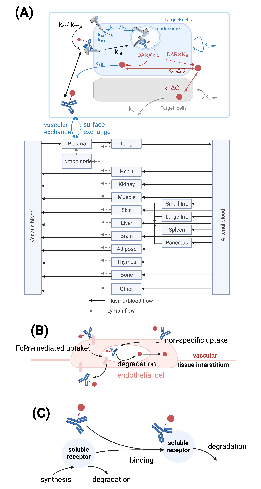</td>
</tr>
<tr>
<td>Fig 1: Model diagram. (A) overall PBPK backbone model for ADC distribution across the system and QSP model for ADC PD model in tumor. (B) ADC uptake and payload dynamics in tissue endothelial cells. (C) Dynamics of ADC and soluble receptor in plasma. (D) Structure of ADC. </td>
</tr>
</table>

# Parameterize the model for T-DM1 and T-Dxd, two HER-2 targeting ADCs

The model was parameterized based on literature values, and was validated using PK data from T-DM1 and T-Dxd obtained from [Girish et al., 2012](https://link.springer.com/article/10.1007/s00280-011-1817-3), [Yamamoto et al., 2015](https://academic.oup.com/jjco/article/45/1/12/887438), and [Doi et al., 2017](https://pubmed.ncbi.nlm.nih.gov/29037983/). The PK validation for T-DM-1 and T-Dxd were shown in Fig 2B and Fig 2A, respectively. 

<table>
  <tr>
    <td>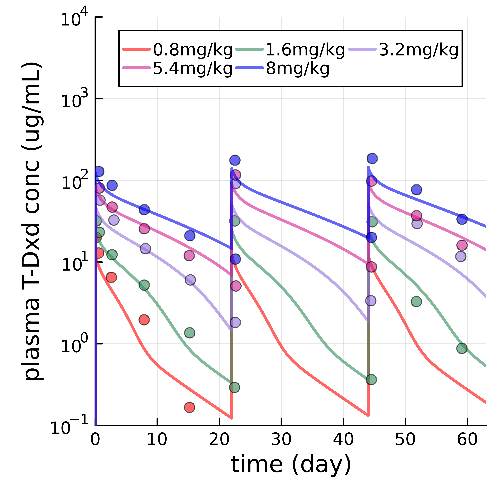</td>
    <td>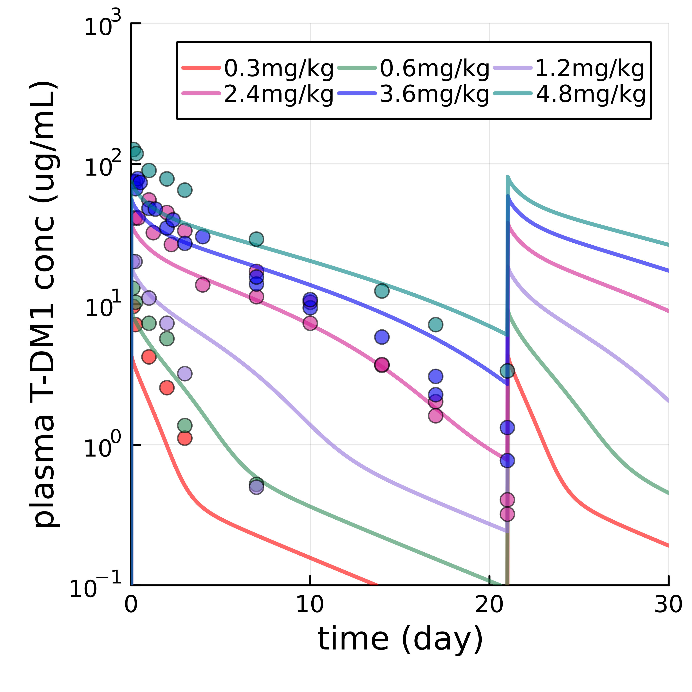</td>
  </tr>
  <tr>
    <td>Fig 2A. T-Dxd PK validation</td>
    <td>Fig 2B. T-DM1 PK validation</td>
  </tr>
 </table>

## Tumor perfusion was predicted to have a major impact on the ADC ended up in tumor

Predicted tissue distribution of T-DM1 was shown in Figure 3. In this case, the total ADC predicted to end up in tumor was 0.01%, less than the estimate from [Nguyen et al, 2023](https://www.ncbi.nlm.nih.gov/pmc/articles/PMC9913659/) that ~ 0.1% of ADC ended up in tumor. This discrepancy might be partially due to ~16.8% ADC was predicted to be degraded after binding to soluble receptor in the plasma, thus never had a chance to make into any tissue.  Our model predicted liver, skin, and lung would get high percentage of total ADC (9.4%, 3.7%, and 3.6%, respectively). Presumably, more ADC was predicted to end up in these tissues was due to better perfusion and being more leaky. 

<table>
<tr>
<td>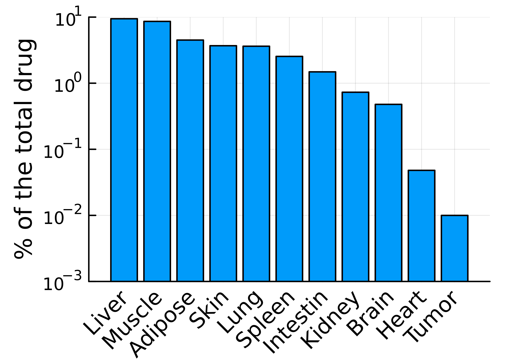</td>
</tr>
<tr>
<td>Figure3: T-DM1 distribution in tissues</td>
</tr>
</table>

To explore what impacted the amount of ADC that ended up in tumor, we explored 3 types of sources of impact: 
1. Target-related. This included target receptor expression level on tumor cells, its endocytosis rate, and soluble receptor concentration in plasma.
2. Tumor-related. This included how well a tumor was perfused (measured by average distance between two blood vessels inside tumor). 
3. ADC-related. This included binding affinity (Kd) between receptor and ADC, and ability for ADC to enter tumor through diffusion. 

Decrease the level of soluble receptor in the plasma was predicted to result in higher percentage of ADC ended up in tumor, up to 0.015% (Fig 4A). Increase in target-ADC internalization rate was also predicted to increase the amount ended up inside tumor (Fig 4B), though on a much less scale compared to soluble ADC amount. Interestingly, higher expression level of target receptor was predicted to result in more ADC in tumor (Fig 4C), but this effect quickly plateau out when target expression level was ~ 10k per cell. Similarly, improvement on anti-tumor effect of also predicted to plateau when target expression level was ~ 10k per cell (Fig 4D). This suggested that there were additional bottleneck, such as the capacity for ADC to enter tumor, might have a more prominent role on ADC efficacy. 

<table>
  <tr>
    <td>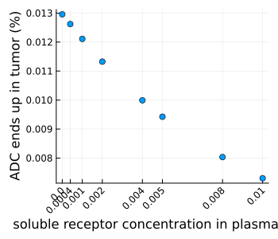</td>
    <td>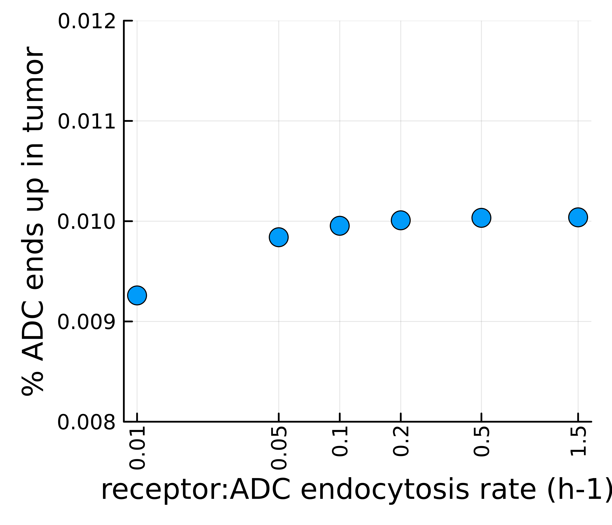</td>
  </tr>
  <tr>
    <td>Fig 4A. Predicted tumor ADC percentage over different soluble receptor concentration in plasma </td>
    <td>Fig 4B. Predicted tumor ADC percentage over different receptor:ADC internalization rate</td>
  </tr>
  <tr>
    <td>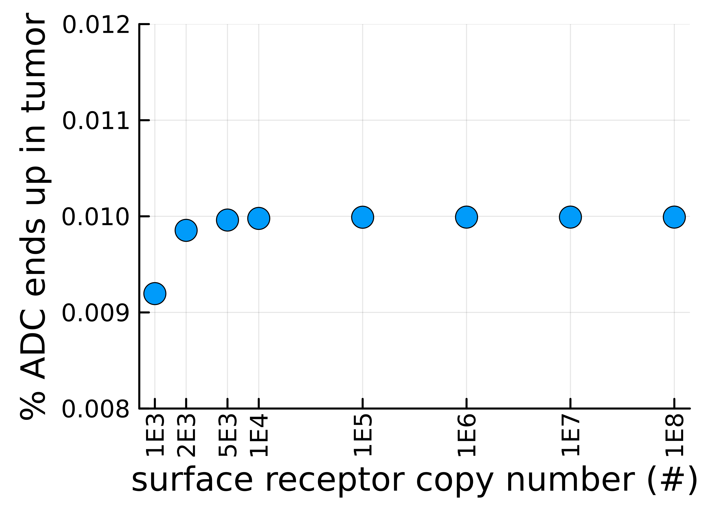</td>
    <td>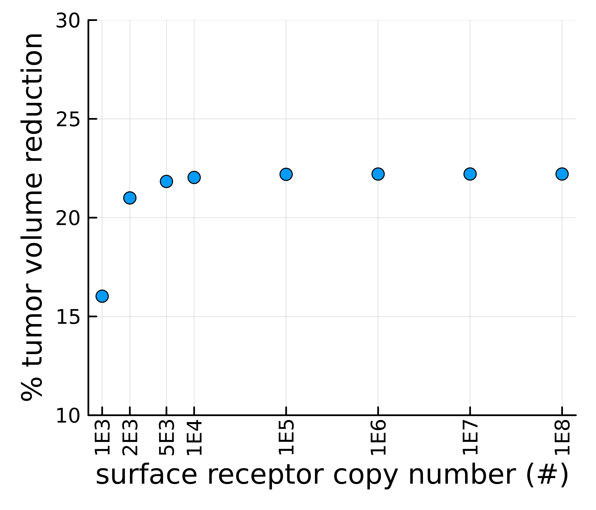</td>
  </tr>
  <tr>
    <td>Fig 4C. Predicted tumor ADC percentage over different average receptor copy number per tumor cell</td>
    <td>Fig 4D. Predicted tumor volume reduction over different average receptor copy number per tumor cell</td>
  </tr>
 </table>

 
Improvement for ADC to enter tumor through either better tumor perfusion (i.e. decrease average distance between 2 adjacent blood vessels in tumor) or better diffusion would increase the fraction of ADC ended up the tumor. 
When the average distance between 2 blood vessels decreased from 75um to 5um, the percentage of ADC ended up in tumor increased from 0.0088% to 0.8% (Fig 5A). Increase ADC's ability to diffuse into tumor was predicted to have a significant impact on the fraction of ADC ended up in tumor. When the ADC permeability increased by 20 folds (from 1 um/h to 20 um/h),  the percentage of ADC ended up in tumor was predicted to increase by more than 7 folds (from 0.0057% to 0.044%). In addition, no plateau was predicted when tumor perfusion improved. All these simulation suggested ADC's delivery into the tumor would be a bottleneck to achieve its anti-tumor effect. 

<table>
  <tr>
      <td>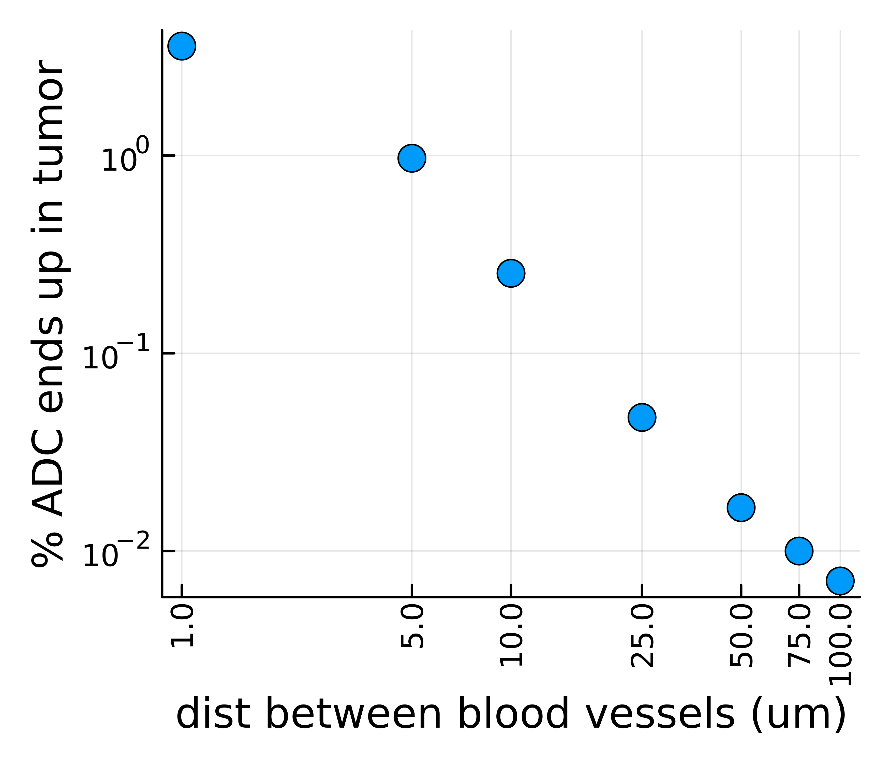</td> 
      <td>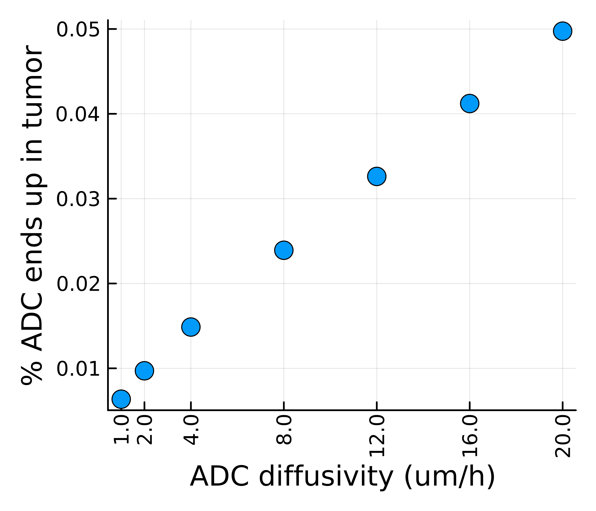</td>
    </tr>
    <tr>
      <td>Fig 5A. Predicted tumor ADC percentage over different tumor perfusion</td>
      <td>Fig 5B. Predicted tumor ADC percentage over different diffusion rate</td>
    </tr>
</table>

What's more interesting, an increase in the binding affinity between target and ADC was predicted to result in more ADC in the tumor (Fig 6A), as well as more tumor volume reduction (Fig 6B). This is counter-intuitive, as people tend to assume that the tighter binding between target and ADC would yield better outcome. 
Our simulation suggested, with the presence of soluble receptors in the plasma, a higher binding affinity would make those soluble receptors more like a reservoir, instead of a sink, to the ADC molecules being delivered into system. This allowed more ADC molecules to end up in tumor. 
In combination with the target highly overexpressed in tumor, the increase in the binding affinity was predicted to have a positive impact on the efficacy.  

<table>
  <tr>
    <td>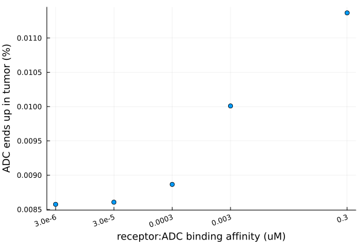</td>
    <td>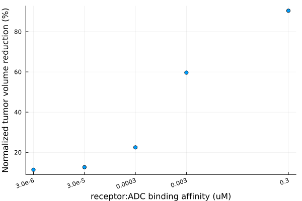</td>
  </tr>
  <tr>
    <td>Fig 6A. Predicted tumor ADC percentage over different binding affinity </td>
    <td>Fig 6B. Predicted tumor volume reduction over different binding affinity </td>
  </tr>
 </table>

## Interstitial ADC could be a source of off-site on-target toxicity 

We explore the ADC concentration in tissue interstitium outside tumor. 

We started with looking at predicted T-DM1 concentration in tissue interstitiums (Fig 7). Our model predicted that intersititial ADC concentration in lung, skin, and small intestin were predicted to be higher than IC50 reported in HER-2 positive cell lines. Considering all these tissues are known to contain HER-2-expressing epithelial cells ([Furrer et al., 2018](https://www.intechopen.com/chapters/61662)), the model predicted toxicity in lung, skin, and small interstin, consistent with the observation reported in [Kowalczyk et al., 2017](https://www.ncbi.nlm.nih.gov/pmc/articles/PMC5803744/). 

<table>
  <tr>
    <td>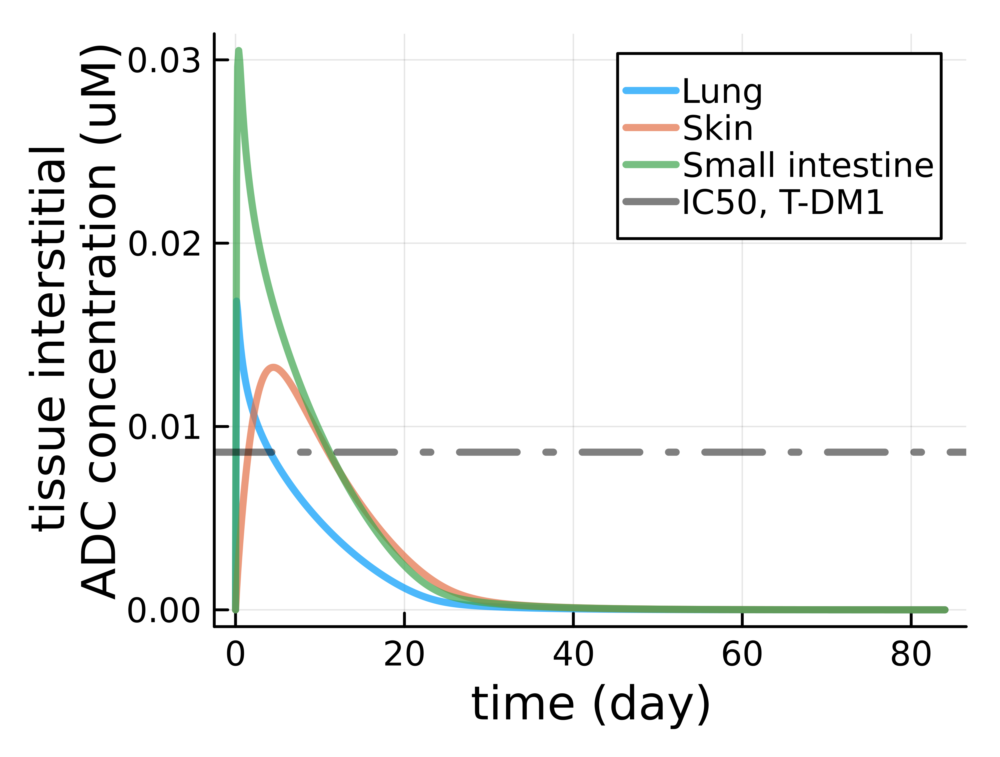</td>
  </tr>
  <tr>
    <td>Fig 7. Predicted ADC concentration in tissue interstitiums</td>
  </tr>
</table>

## Free payload as a source of off-target toxicity

To explore the possibility to use this model to predict ADC off-target toxicity, we decided to look into predicted payload concentrations in tissues. 
Specifically, we looked into both predicted payload concentration in tissue interstitium, and payload concentration in endothelial cells. 
Endothelial cells expressed FcRn receptors. ADC entered endothelial cells through these FcRn receptors, a non-target receptor mediated internalization.
We compared payload concentration in these endothelial cells to both the tumor cellular payload concentration, as well as their IC50 reported in literature. 
As expected, tumor cellular payload concentration was predicted to be the highest. 
Payload concentration was predicted to be high in liver endothelial cells, lung endothelial cells, and liver interstitium, higher than the IC50 of the payload in the case of T-DM1 (Fig 8A). This prediction was consistent with hepatotoxicity reported on T-DM1 ([Cobert et al., 2020](https://www.ncbi.nlm.nih.gov/pmc/articles/PMC7175051/), [Kowalczyk et al., 2017](https://www.ncbi.nlm.nih.gov/pmc/articles/PMC5803744/), [Ma et al., 2023](https://pubmed.ncbi.nlm.nih.gov/37068935/)). 

In contrast, free payload concentration of T-Dxd was predicted to be much lower in either endothelial cells or tissue interstitium, lower than IC50 for the majority of the time (Fig 8B). This was consistent with the lack of hepatotoxicity reported on T-Dxd. The increase of free payload diffusion in T-Dxd allowed payload to diffuse into organ interstitium to be cleared, so that the free payload would not accumulate inside endothelial cells to cause toxicity.
In addition, in the same tissue, the payload concentration inside endothelial cells and in intersititium was predicted to converge, consistent with the idea of Dxd being an easily diffusible payload. 

However, this could not explain why T-Dxd is more likely to induce lung interstitial disease than T-DM1 ([Ma et al., 2023](https://pubmed.ncbi.nlm.nih.gov/37068935/)). This may be due to the current model does not include interaction between tumor and nearby organ. The diffusion of payload might be a source of lung interstitial disease in lung cancer treatment.

<table>
  <tr>
    <td>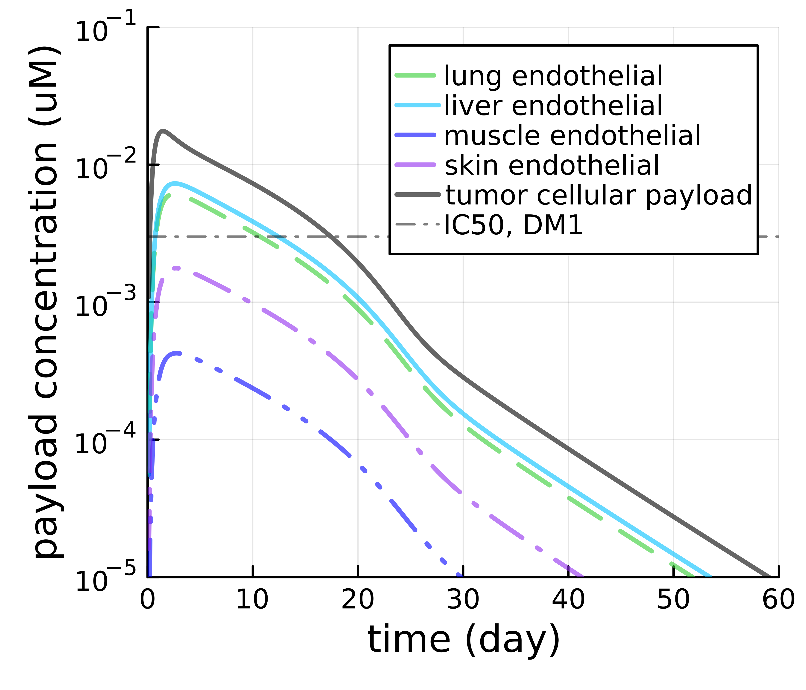</td>
    <td>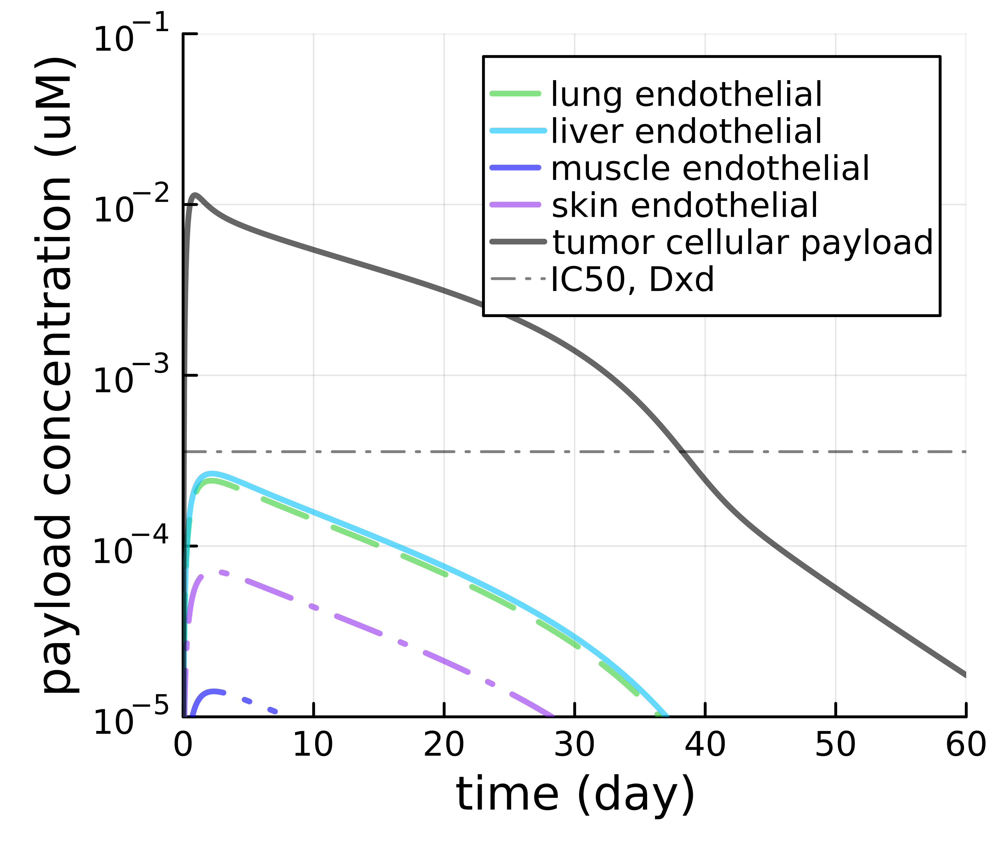</td>
  </tr>
  <tr>
    <td>Fig 8(A) Predicted tissue payload concentration, T-DM1</td>
    <td>Fig 8(B) Predicted tissue payload concentration, T-Dxd</td>
  </tr>
 </table>

Building on the idea that payload diffusibility would play an important role on off-target toxicity, we look into if the model could explain the lack of hepatotoxicity of brentuximab-vedotin, and the high hepatotoxicity of cantuzumab mertansine ([Masters et al., 2018](https://pubmed.ncbi.nlm.nih.gov/29027591/)). 

We firstly show their models could reproduce their PK profiles, respectively. Fig 9A showed the PK of brentuximab vedotin calibrated between 1.2mg/kg and 2.7mg/kg, as reported in [Younes et al., 2010](https://www.nejm.org/doi/full/10.1056/NEJMoa1002965)). Fig 9B showed the PK of cantuzumab mertansine calibrated to 235mg/m2, the only PK reported in [Tolcher et al., 2003](https://pubmed.ncbi.nlm.nih.gov/12525512/). 

<table>
  <tr>
    <td>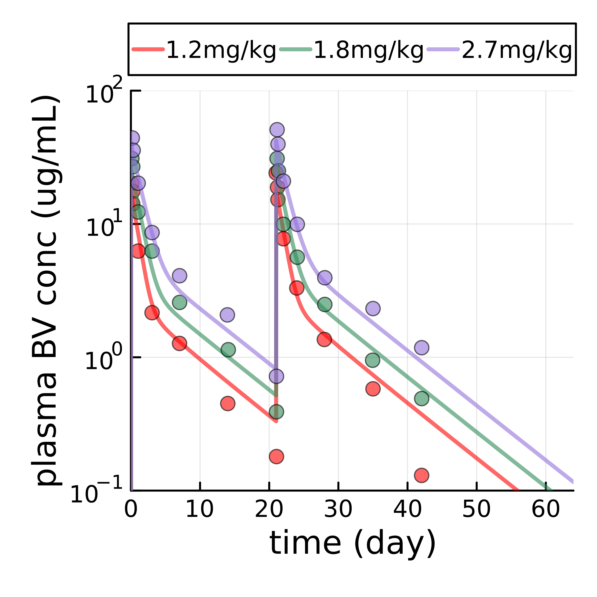</td>
    <td>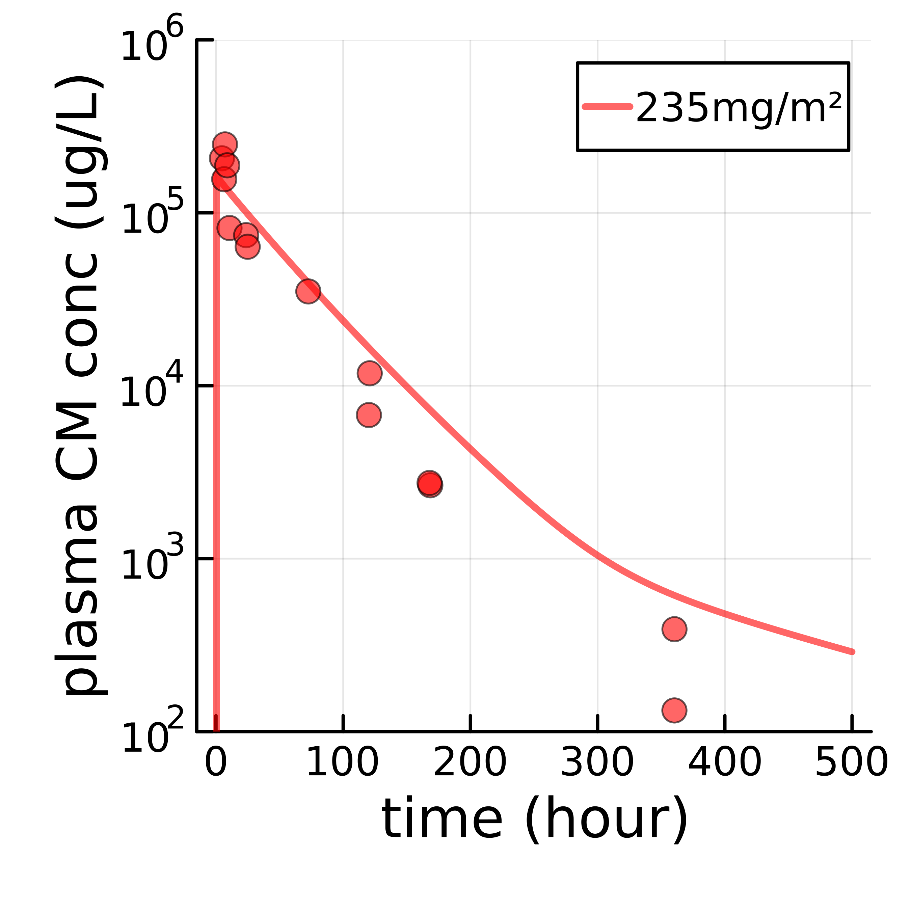</td>
  </tr>
  <tr>
    <td>Fig 9(A) PK of brentuximab vedotin (observed data obtained from Younes et al., 2010)</td>
    <td>Fig 9(B) PK of cantuzumab mertansine (observed data obtained from Tolcher et al., 2003)</td>
  </tr>
 </table>

We then look into the free payload concentration in liver intersititum. In the case for brentuximab vedotin, we only look into tissue intersititium payload concentration. This is due to the payload monomethyl auristatin E (MMAE) could diffuse across memebrane after being cleaved off the mAb. Thus, we assume there is a fast equilibration between cells and interstitium. 
In the clinical dose at 1.2mg/kg (Fig 10A), the payload concentration was predicted to be more than 10 times lower than its IC50. Even increasing the dose to  1.8mg/kg (Fig 10B) was still predicted to be lower than its IC50. 

<table>
  <tr>
    <td>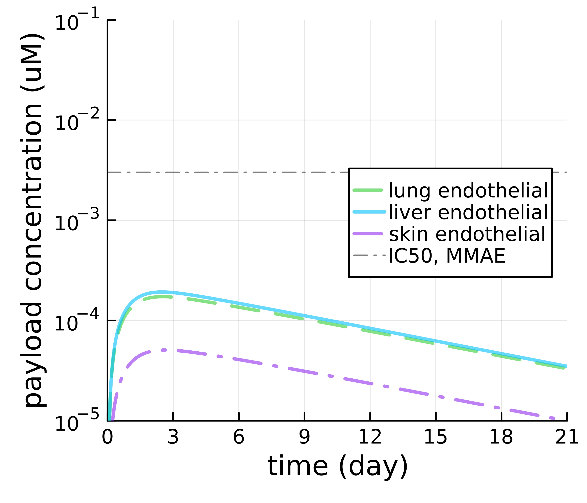</td>
    <td>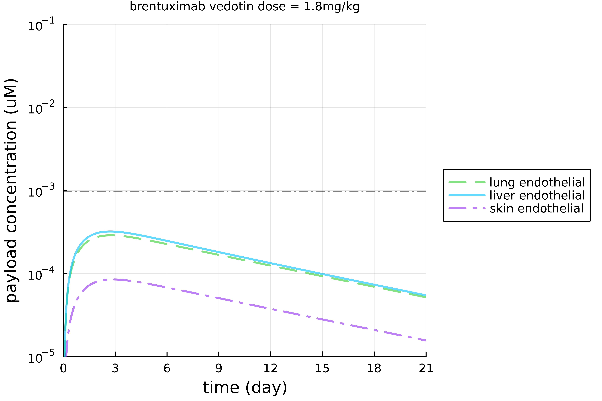</td>
  </tr>
  <tr>
    <td>Fig 10(A) Predicted tissue payload concentration, brentuximab vedotin 1.2mg/kg</td>
    <td>Fig 10(B) Predicted tissue payload concentration, brentuximab vedotin 1.8mg/kg</td>
  </tr>
 </table>

We then look into cantuzumab mertansine, an ADC reported to have hepatotoxicity ([Masters et al., 2018](https://pubmed.ncbi.nlm.nih.gov/29027591/)). With the dose recommended by in [Tolcher et al., 2003](https://pubmed.ncbi.nlm.nih.gov/12525512/), the predicted payload concentration in both liver endothelial cells, liver interstitium were all above IC50 of the payload (Fig 11A).  

Simulations over all the doses mentioned in [Tolcher et al., 2003](https://pubmed.ncbi.nlm.nih.gov/12525512/) predicted at dose 88 mg/m2, the liver interstitial payload concentration would be above its IC50, causing hepatic toxicity. This prediction was consistent with the clinical observation that hepatic toxicity was observed in patients receiving dose bigger than 88 mg/m2 during the first course. 

<table>
  <tr>
    <td>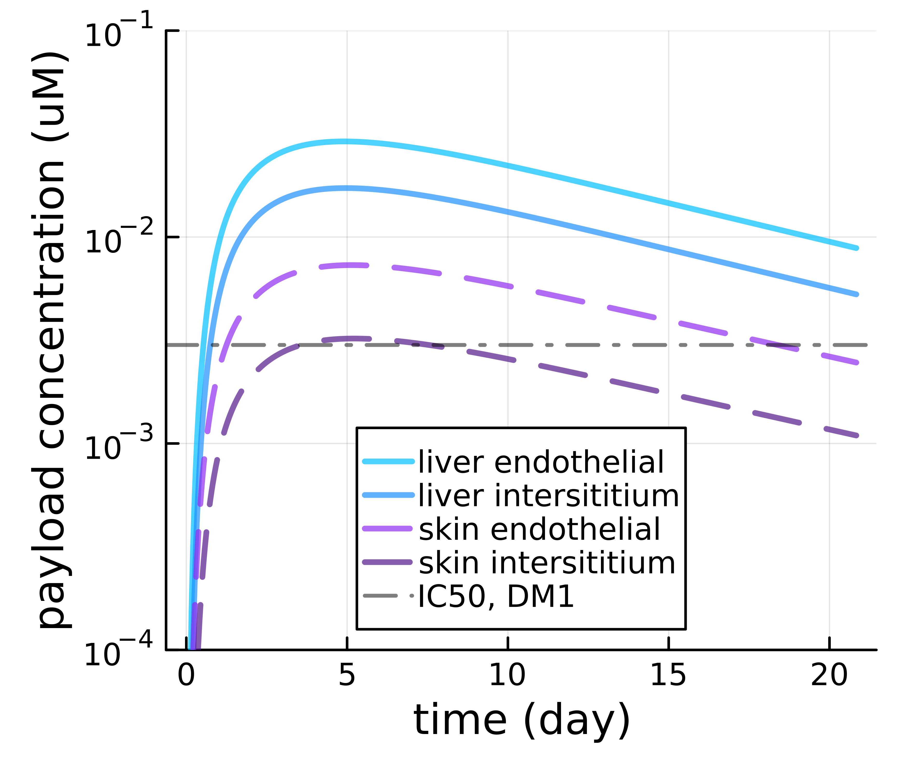</td>
    <td>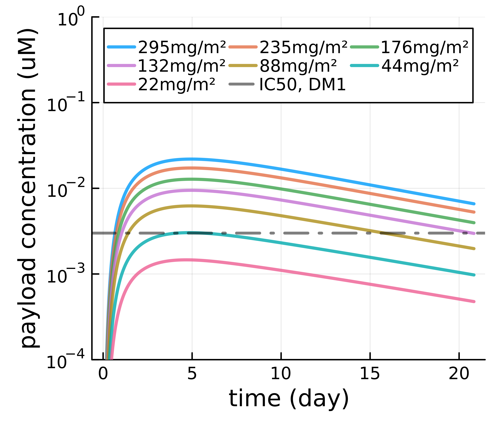</td>
  </tr>
  <tr>
    <td>Fig 11(A) Predicted tissue payload concentration, cantuzumab mertansine 235mg/m2, the recommended dose from Phase I trial  </td>
    <td>Fig 11(B) Predicted payload concentration in liver interstitium, dose of cantuzumab mertansine obtained from Tolcher et al., 2003</td>
  </tr>
 </table>

# Discussion 

In this repo, we demonstrated that our PBPK model could be used to predict ADC toxicities. We demonstrate its capacity to predict both on-target and off-target toxicities on 4 different ADCs. Our simulation suggested that, for an ADC targeting solid tumor, the majority of the payload would end up outside tumor (>99%). These ADC molecules ended up outside tumor would be the major source of toxicity. This is largely the result of mAb physiology. Future engineering of the mAb on ADC warhead should be conducted to change this phenomenon. 

In addition, our simulation suggested, with the same monoclonal antibody, a diffusible payload would likely to cause less off-target toxicity. This is due to toxic payload was predicted to less likely to accumulate inside cells. 

However, this model also have limitations: 

1. Same clearance of payload in all organs. This may be different for liver, since hepatocytes tend to have the enzymes to degrade payload. (this makes cellular payload concentration prediction a more pessimistic estimation).
2. No payload modeling. A PBPK model for payload on top of the existing PBPK model for ADC distribution would be helpful to better characterize payload dynamics. See [Chang, Cheung, and Shah, 2021](https://www.mdpi.com/2077-0383/10/6/1332) for future work. 
3. No blood cell incorporated in the model, so hard to capture toxicities in the blood (e.g. perspective, neutropenia). Potential future steps including adopting blood cell model from [Shah and Betts, 2012](https://pubmed.ncbi.nlm.nih.gov/22143261/). 
4. No direct implementation of off-site target-expressing cells. 
5. No implementation of eye model, so that ocular toxicity could not be assessed. Further work would be incorporating [Bussing and Shah, 2021](https://www.ncbi.nlm.nih.gov/pmc/articles/PMC7658046/).
6. Does not take deconjugation outside cells into account. 
7. Tumor model is for solid tumor only. Lymphoma would be modeled very differently from solid tumor because they are much easier to be penetrated by ADCs. To model a lymphoma (such as for brentuximab vedotin), see [Caimi et al., 2022](https://productiontest.adctmedical.com/wp-content/uploads/2022/12/ASH-2022_Caimi_LOTIS-2_CD19-QSP-modeling-poster_FINAL.pdf).

# Conclusion 

Our PBPK model provided a platform to predict ADC toxicity. 
