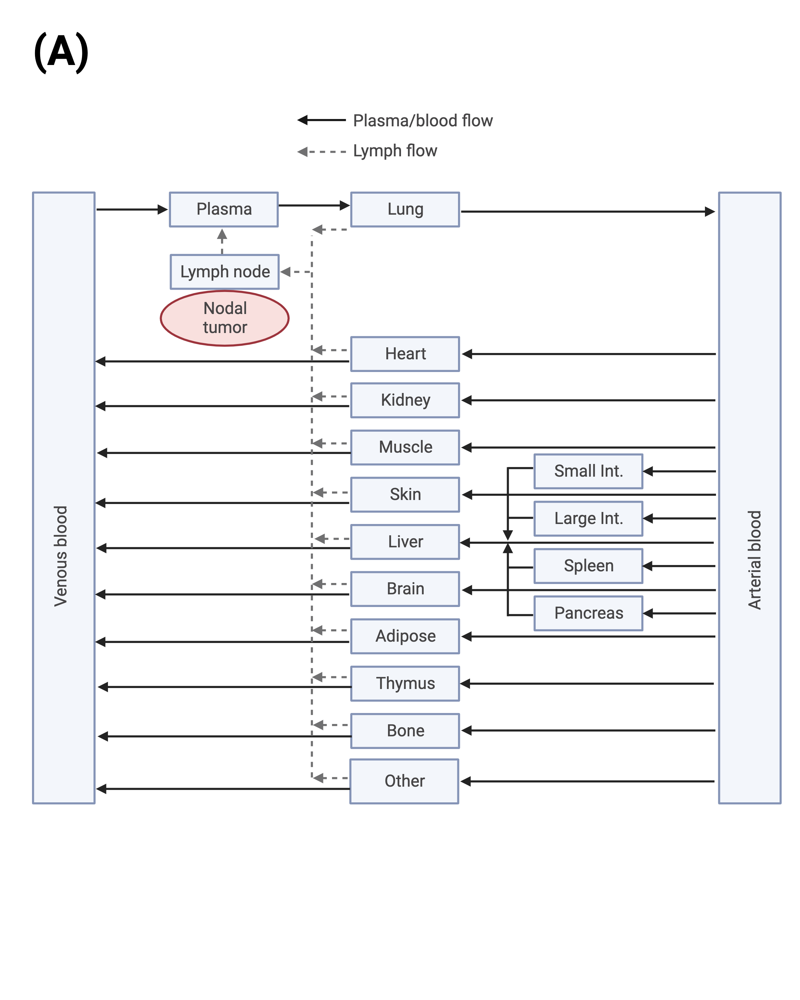
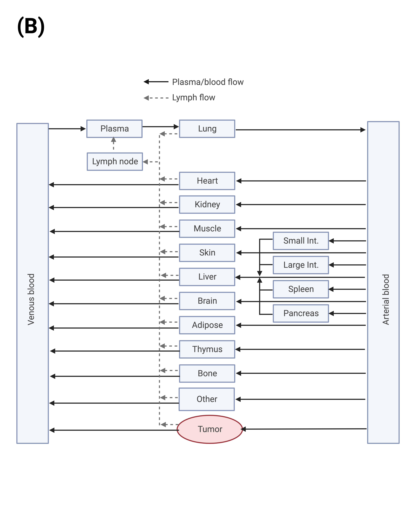
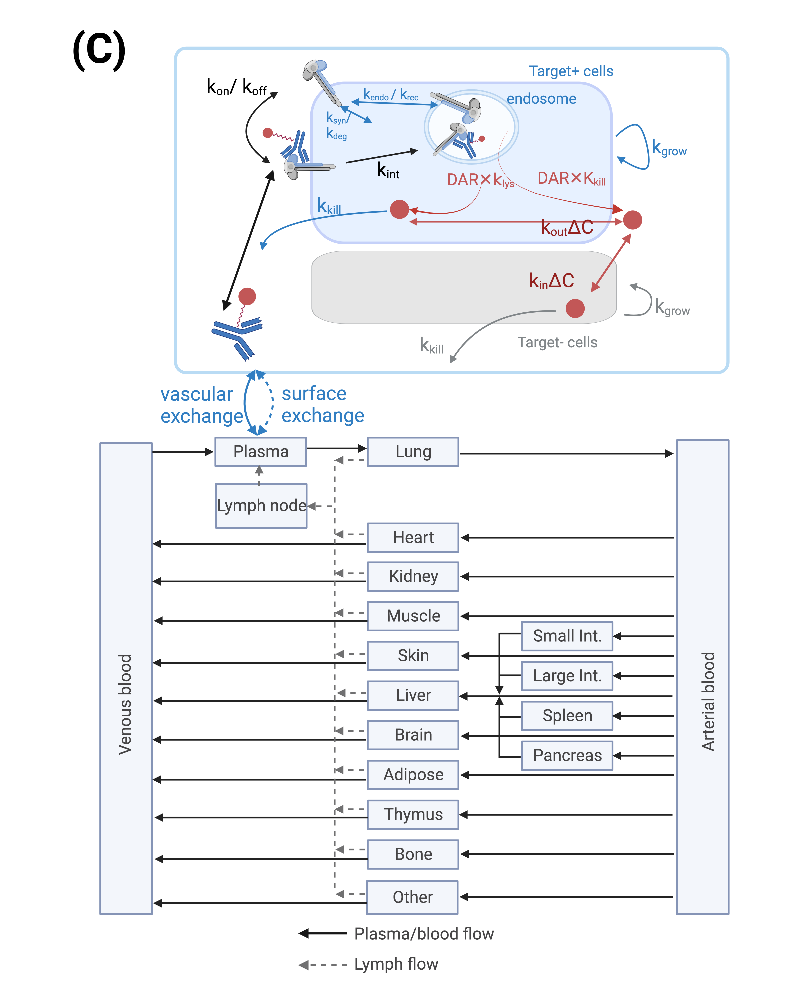
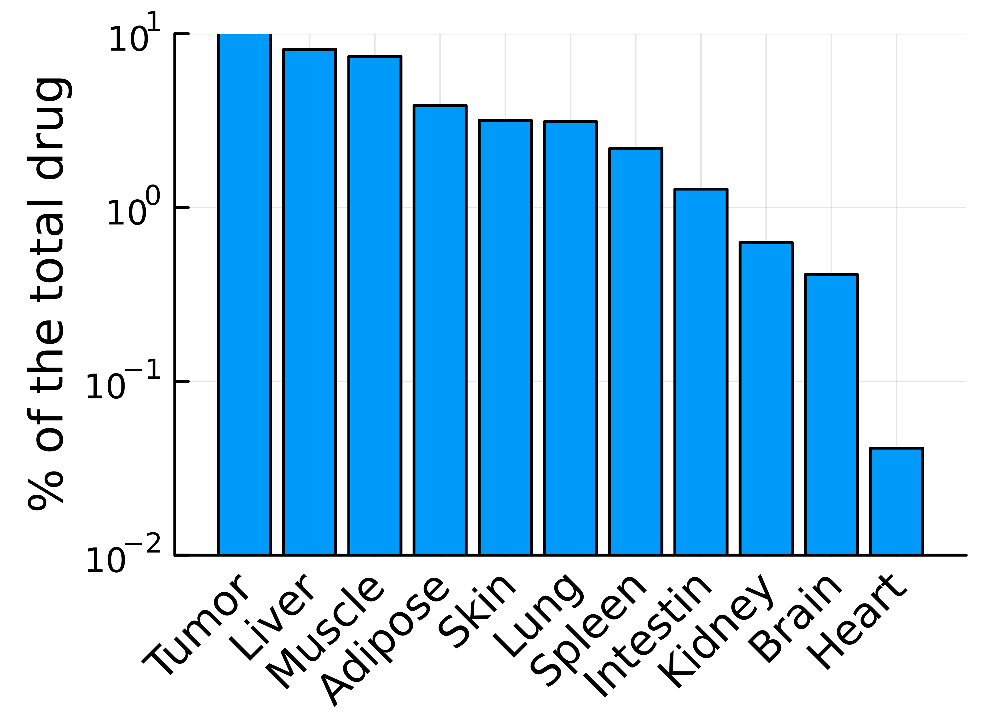
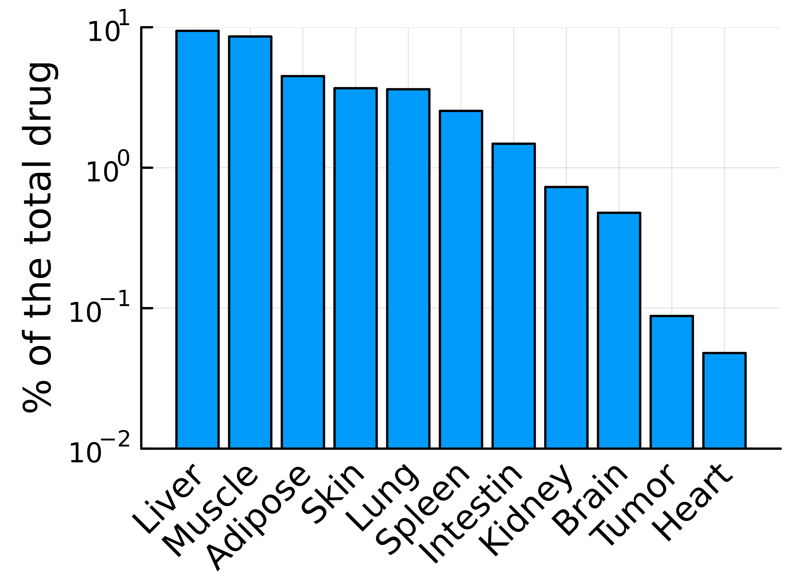
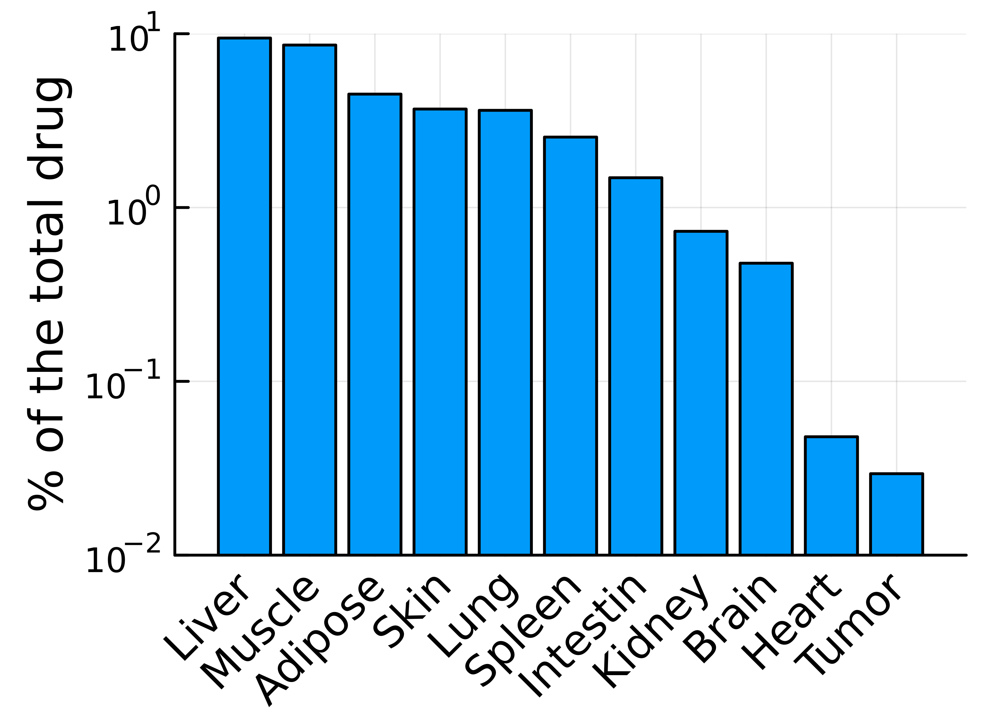

# ADC distribution into tumor

The purpose of this repo is to compare ADC distribution into nodal tumor (Fig 1A) and solid tumor (Fig 1B, C). 
The PBPK backbone to model the systematic ADC distribution was adapted from [Jones et al., 2019](https://ascpt.onlinelibrary.wiley.com/doi/10.1002/psp4.12461). 
Especially, for the solid tumor, we use 2 different model methods: 1. model it as another organ (Fig 1B), or using the model published in [Shah et al., 2012](https://pubmed.ncbi.nlm.nih.gov/23151991/) (Fig 1C). The PD model as taken from [Scheuher et al., 2022](https://www.researchsquare.com/article/rs-2371793/v1) as a placeholder. 

<table>
  <tr>
    <td></td>
    <td></td>
    <td></td>
  </tr>
  <tr>
    <td>Fig 1(A) Diagram for nodal tumor. </td>
    <td>Fig 1(B) Diagram for modeling tumor as another organ.</td>
    <td>Fig 1(C) Diagram for modeling tumor following Shah et al., 2012.</td>
  </tr>
 </table>

When given a dose of 3.6mg/kg of T-DM1, the models predicted the percentage of ADC ended up in the tumor as follows: 
Nodal tumor had a highest fraction of ADC ended up there (~10\%), while the ADC fractions ended up in solid tumor were predicted to between 0.02\% and 0.1\%.

<table>
  <tr>
    <td></td>
    <td></td>
    <td></td>
  </tr>
  <tr>
    <td>Fig 2(A) ADC distribution, nodal tumor. </td>
    <td>Fig 2(B) ADC distribution, solid tumor as another organ.</td>
    <td>Fig 2(C) ADC distribution, solid tumor modeled as Shah et al., 2012.</td>
  </tr>
 </table>

