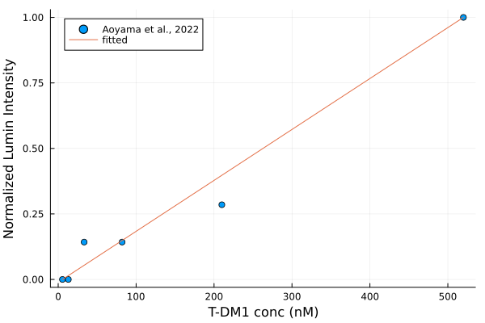
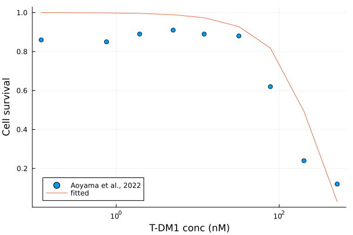
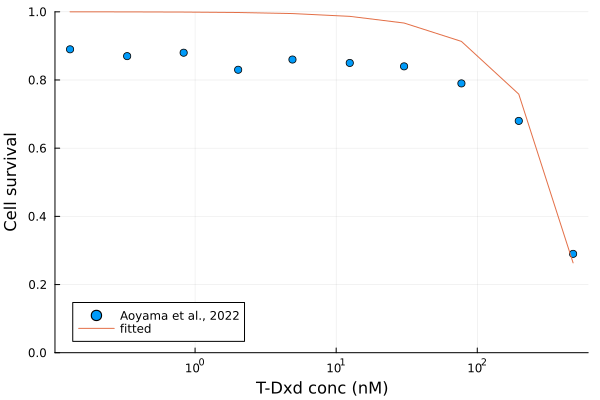

# Explore ADC toxicity mediated by FcγR

To explore FcγR-mediated ADC uptake and toxicity in receptor-negative cells. In this model, we assume that FcγR-mediated ADC uptake into cells through a fixed rate (`k_in_FcgR`). Once these ADC molecules are in the cells, they go through lysosomal degredation ([Molfetta et al., 2014](https://www.ncbi.nlm.nih.gov/pmc/articles/PMC4166898/)) and release the payload. These payload molecules causes cytotoxicity and lead to cell death.  

Here, we use T-DM1 and T-Dxd as examples. Data obtained from [Aoyama et al., 2022](https://www.ncbi.nlm.nih.gov/pmc/articles/PMC8837541/). 

Currently only have fitting data on T-DM1 on a T cell line (see `tdm1_jurkat_invitro.jl`). 

<table>
  <tr>
    <td></td>
    <td></td>
    <td></td>
  </tr>
  <tr>
    <td>Figure 7A. FcγR-mediated internalization on Junkat cells.</td>
    <td>Figure 7B. T-DM1-mediated cytotoxicity on Junkat cells.</td>
    <td>Figure 7B. T-Dxd-mediated cytotoxicity on Junkat cells.</td>
  </tr>
 </table>

