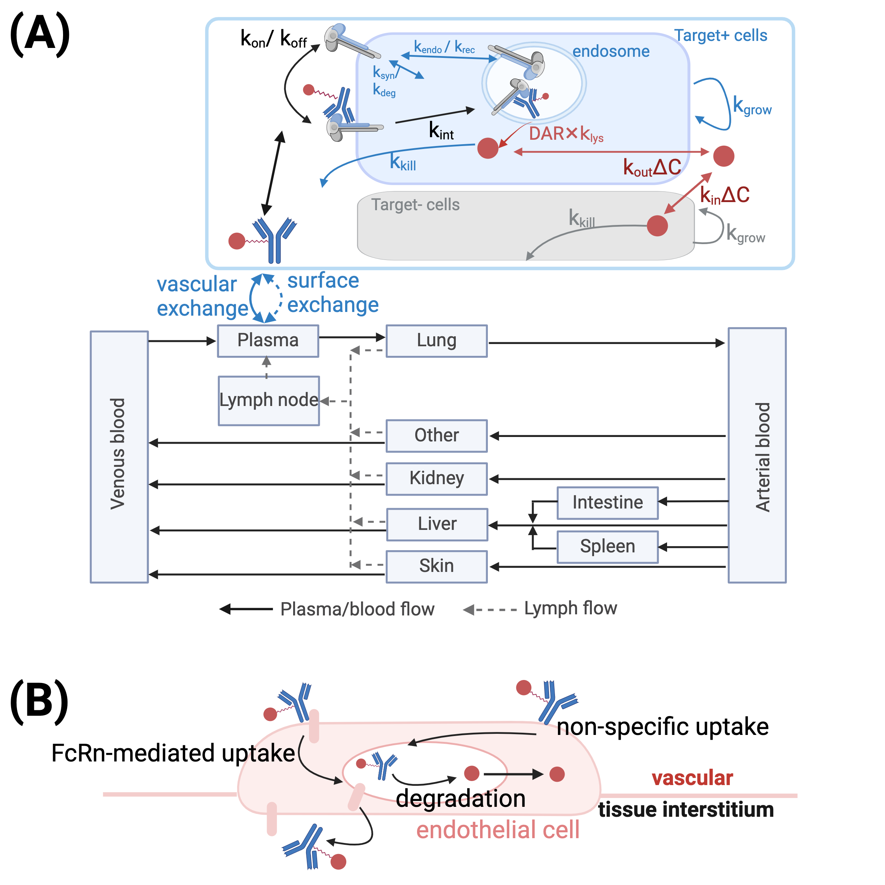

# Reduce the physiological complexity of PBPK model 

Only a few organs that are commonly reported for ADC toxicity (e.g. skin, lung, liver) or potential physiological importance in PK (e.g. kidney) or immune response (e.g. lymph nodes, spleen) are kept in the simplified model. The rest organs are lumped together. That is, large intestine, small intestine, and pancreas are lumped into "Intestine", and heart, muscle, adipose, bone, brain, thymus are lumped into the "Other" organ. The model diagram is shown in Figure 1A. 

Inside each organ, the model keeps all the mechanistic details of FcRn-mediated and non-specific uptake of ADC by endothelial cells before either enter organ interstitium or recycle back to the plasma (Figure 1B). 

A dummy solid HER2+ tumor was included in the model as a placeholder tumor model. The model is taken from [Scheuher et al., 2023](https://link.springer.com/article/10.1007/s10928-023-09884-6).

<figure class="image">
  
  <figcaption>Figure 1. Simplified model diagram.</figcaption>
</figure>

Simulation results from simplified model was compared with results from the full model under the same condition. We show concentrations in plasma, skin, liver, and kidney interstitiums as example to demonstrate the results are comparable (Figure 2). 

<figure class="image">
  
  <figcaption>Figure 2. Simplified model verification.</figcaption>
</figure>

# Clinical PK of ADCs

## HER2-targeting ADC 

5 HER2-targeting ADC was chosen for this model. Their clinical PK was shown in Figure 3A-C.  

<table>
  <tr>
    <td></td>
    <td></td>
    <td></td>
  </tr>
  <tr>
    <td>Figure 3A. T-Dxd PK validation</td>
    <td>Figure 3B. T-DM1 PK validation</td>
    <td>Figure 3C. DHES0815A PK validation</td>
  </tr>
 </table>

| ADC | mAb | Linker | Payload | Bystander effect | DLT | Status | 
| --- | --- | ------ | ------- | ---------------- | --- | ------ |
| T-DM1 | trastuzumab | uncleavable MCC linker | DM1 | No | TCP | Approved |
| T-Dxd | trastuzumab | cleavable tetrapeptide linker | Dxd | Yes | N.A. Reported toxicity events include grade 3 decrease in lymphocytes, neutrophils, and 1 case for grade 4 anemia ([Toi et al., 2017](https://pubmed.ncbi.nlm.nih.gov/29037983/)) | Approved | 
| DHES0815A | hu7C2 | hindered disulfide linker | PBD-monoamide | Yes | N.A. | Discontinued due to persistent safety findings |
| SYD985 | transtuzumab | cleavable vc linker | duocarmycin | Yes | Pneumonitis ([Banerji et al., 2019](https://pubmed.ncbi.nlm.nih.gov/31257177/))  | Discontinued (unspecified reason) |
| ARX788 | transtuzumab | A non-natural amino acid linker para-acetyl-phenylalanine (pAcF) | MMAF | No | NA ([Zhang et al., 2022](https://pubmed.ncbi.nlm.nih.gov/36384091/)) | Phase III | 

Clinical PK for SYD985 and ARX788 could not be found, but since its mAb is trastuzumab, then the PK parameters should be the same as T-DM1 and T-Dxd. 

## Trop2-targeting ADC

 2 Trop-2 targeting ADC, datopotamab deruxtecan (Dato-Dxd), and sacituzumab govitecan (SG), were chosen for this model. Their clinical PK was shown in Figure 5A-B. 

 <table>
  <tr>
    <td></td>
    <td></td>
  </tr>
  <tr>
    <td>Figure 5A. Dato-Dxd PK validation</td>
    <td>Figure 5B. Sacituzumab govitecan PK validation</td>
  </tr>
 </table>

