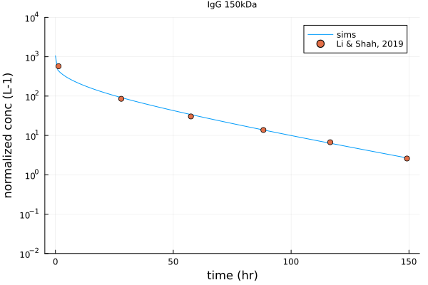

# About
This is an implementation of [Li and Shah, J Pharmacokinet Pharmacodyn., 2019](https://www.ncbi.nlm.nih.gov/pmc/articles/PMC6531344/). 

# Prerequisites

Julia 1.7.2 and the following Julia packages:
1. DifferentialEquations
2. Plots
3. DataFrames
4. CSV
5. ComponentArrays
6. Parameters

# Setup

Use the provided `Project.toml` and `Manifest.toml` files to create a static environment that is an exact snapshot of the environment we used to produce the outputs in this `README.md` file.

For this, after running Julia in the main root of this local folder, enter package `Pkg` environment and issue:

```
activate .
instantiate
```

# Model implementation and verification

A few adjustments have been carried out to make sense of the original model. 

1. For interstitial protein concentration , the term  was dropped to keep mass balance. This adjustment was also consistent with the model published by the same authors in 2021 ([Li et al., 2021](https://link.springer.com/article/10.1007/s10928-021-09772-x)).

2. For the nanobody verification, since the Figure 3 PK profile of nanobody appeared to make no sense (i.e. nanobody appeared to have less clearance compared to scFv, and contradicted later simulations ([Li et al., 2021](https://link.springer.com/article/10.1007/s10928-021-09772-x))), thus nanobody were compared to the original experimental data from [Gainkam et al., 2008](https://jnm.snmjournals.org/content/49/5/788) for validation purpose. 

3. Additional validation on scFv (27kDa), Fab (50kDa) due to contradictory simulation results from [Li et al., 2021](https://link.springer.com/article/10.1007/s10928-021-09772-x). 
For the scFv verification, experimental data were obtained from [Milenic et al., 1999](https://aacrjournals.org/cancerres/article/51/23_Part_1/6363/497170/Construction-Binding-Properties-Metabolism-and), [Wu et al., 1996](https://pubmed.ncbi.nlm.nih.gov/9373325/). 
For the Fab verification, experimental data were obtained from [Otsuji et al., 2003](https://onlinelibrary.wiley.com/doi/abs/10.1002/jso.10311) and [Milenic et al., 1999](https://aacrjournals.org/cancerres/article/51/23_Part_1/6363/497170/Construction-Binding-Properties-Metabolism-and). 

4. Correction on glomerular sieving coefficient calculation. In [Li and Shah, 2019](https://www.ncbi.nlm.nih.gov/pmc/articles/PMC6531344/), the glomerular sieving coefficient calculation was reported to be based on formula  (MW in kDa). But this equation would result in the prediction of higher glomerular sieving coefficient for proteins with higher molecular weight. This contradicted common sense, and could not generate the glomerular sieving coefficient values in [Li and Shah, 2019](https://www.ncbi.nlm.nih.gov/pmc/articles/PMC6531344/) Table 4. We believed the correct formula should be  for 3 reasons: 1. this formula generated glomerular sieving coefficient values that were consistent with Table 4 (see below); 2. this formula generated glomerular sieving coefficient values that were consistent with what was reported in [Haraldsson et al., 2008](https://pubmed.ncbi.nlm.nih.gov/18391170/); 3. the corrected formula was more consistent with the formula used in [Li, Keippendorff, and Shah, 2017](https://pubmed.ncbi.nlm.nih.gov/28681164/).


| Names    | Molecular weight (kDa) |  from corrected formula |   reported in Li and Shah, 2019| 
| -------- | ------- |  ------- |  ------- |
nanobody | 13 | 0.6774 | 0.677 | 
scFv | 27 | 0.4026 | 0.403 | 
Fab | 50 | 0.1307 | 0.131 | 
scFv2 | 55 | 0.0986 | 0.0986 | 
minibody | 80 | 0.02199 | 0.022 |
Fab2 | 100 | 0.00703 | 0.00703 |
IgG | 150 | 0.001099 | 0.0011 |


The validations of nanobody (13kDa) and scFv (27kDa) were provided as follow. 

<table>
<tr>
<td></td>
  <td></td>
</tr>
</table>

The simulation on Fab (50kDa) didn't completely match what was provided in [Li and Shah, 2019](https://www.ncbi.nlm.nih.gov/pmc/articles/PMC6531344/), but was close; in addition, the simulation result was close to experimental observation reported in [Milenic et al., 1999](https://aacrjournals.org/cancerres/article/51/23_Part_1/6363/497170/Construction-Binding-Properties-Metabolism-and) and [Otusiji et al., 2003](https://onlinelibrary.wiley.com/doi/abs/10.1002/jso.10311). 

<table>
<tr>
<td></td>
  <td></td>
</tr>
</table>

The simulations at larger than 80kDa (minibody) matched simulations provided by [Li and Shah, 2019](https://www.ncbi.nlm.nih.gov/pmc/articles/PMC6531344/). 

<table>
  <tr>
    <td></td>
    <td></td>
    <td></td>
  </tr>
 </table>
 
# Future direction 

1. tumor penetrance modeling for small therapeutics protein. 
2. Linking protein charge with glomerular sieving coefficient. 

# Contents

- data: folder that hosts all literature data 
- deliv: folder that hosts all output files (tables, figures)
- model: folder that hosts the model described in [Li and Shah, 2019](https://www.ncbi.nlm.nih.gov/pmc/articles/PMC6531344/) (i.e. `twopore_mus.jl`).
- script: folder hosts scripts for simulation: 
  - `gfr-sieving-coef.jl`: to explore the calculation of glomerular sieving coefficient. 
  - `helper.jl`: this script hosts parameters and initialization for the Li and Shah model. 
  - `mass_balance.jl`: to verify the mass balance of exogenous therapeutic protein in the system. 
  - `runTest.jl`: to generate simulations. 
- Manifest.toml: Julia environment file. 
- Project.toml: Julia environment file. 
- README.md: this readme file. 
- TwoPore.proj. 
