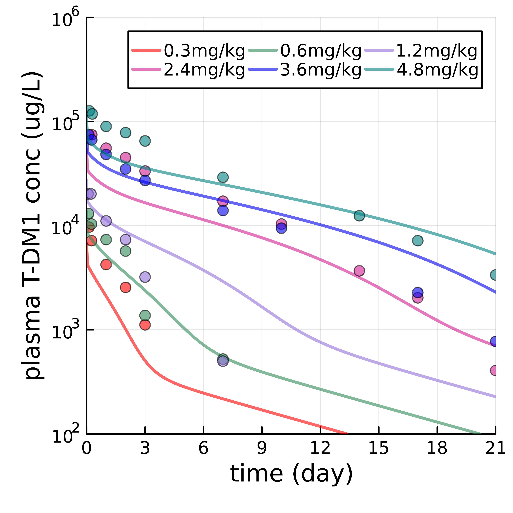
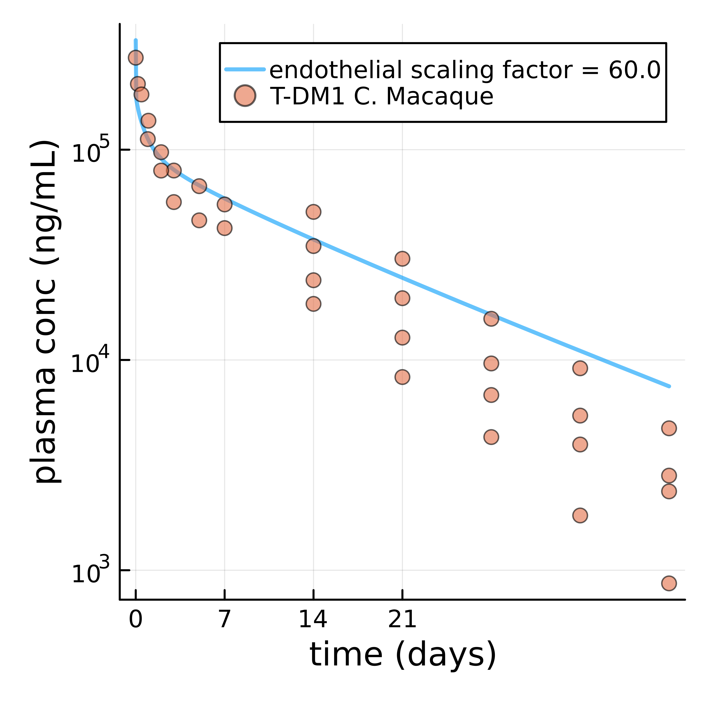
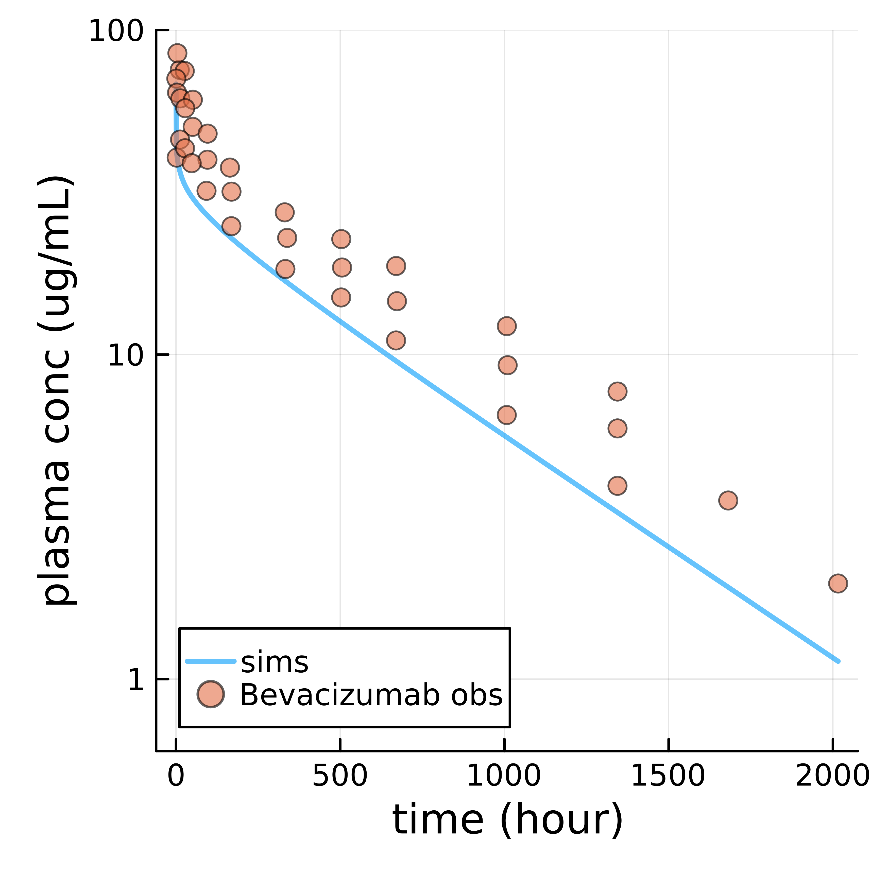
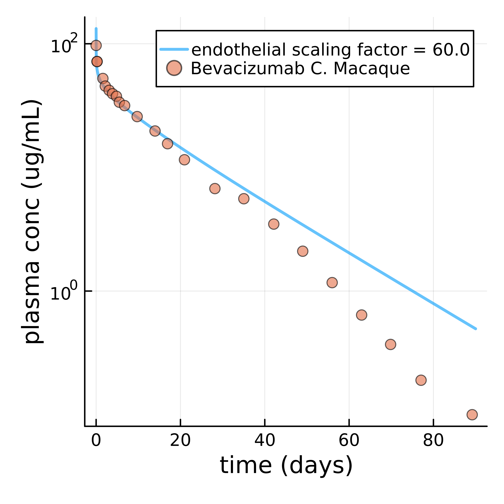
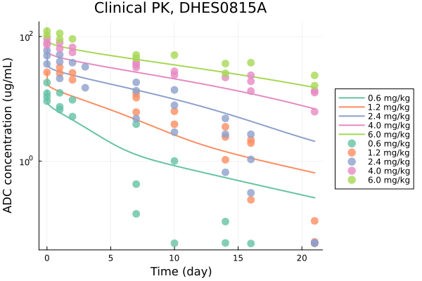
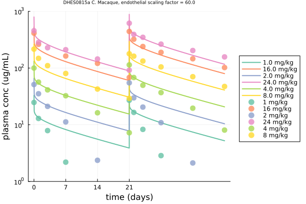

# PBPK model for cynomolgus macaque

The purpose of the repo is to build a ready-to-use physiologically-based pharmacokinetic (PBPK) model for cynomolgus macaque. The backbone of the model was obtained from [Jones et al., 2019](https://pubmed.ncbi.nlm.nih.gov/31464379/). 

C. macaque organ volumes and other physiological parameters from [Shah and Betts, 2012](https://pubmed.ncbi.nlm.nih.gov/22143261/). However, an parameter called endothelial scaling parameter was not provided in literature. The purpose of this repo was to tune this value. 

The drug used for this repo was trastuzumab emtansine (T-DM1). Monkey and human PK were obtained based on literature. See `readme.md` in `data/` for more information. 

The comparison of T-DM1 PK between monkey (right) and human (left) were as below. The endothelia scaling factor between monkey and human had ~ 10 folds difference. 

<p align="center">
    
    &nbsp;
  
</p>

The comparison of bevacizumab PK between monkey (right) and human (left) were as below. 

<p align="center">
    
    &nbsp;
  
</p>

The comparison of DHES0815a PK between monkey (right) and human (left) were as below.  

<p align="center">
    
    &nbsp;
  
</p>

## Content of this folder

Folders: 

- `data`: the folder holds observed data.
- `img`: the folder where simulation images were saved.

Scripts: 

- `helper.jl`: this script hosts helper function for simulation. 
- `jonesODEs3Homo.jl`: PBPK model for human. 
- `jonesODEs3Monkey.jl`: PBPK model for monkey.  
- `main-t-dm1-cyno.jl`: main script to run simulation for T-DM1 PK in monkey. 
- `main-t-dm1-homo.jl`: main script to run simulation for T-DM1 PK in human. 
- `param.jl`: this script hosts parameters used in simulation. 
- `Manifest.toml`: Julia environment file. 
- `Project.toml`: Julia environment file. 
- `README.md`: This readme file. 

## Set up Julia environment 

The simulations were run in Julia 1.7.2. 
The `Project.toml` and `Manifest.toml` are Julia environment files. 
To set up, start Julia, navigate the folder, and go into Pkg manager, and activate the environment through the following commands:
```
activate .
instantiate 
```
