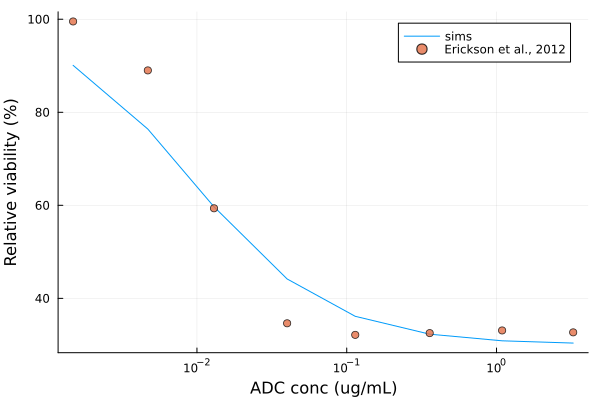
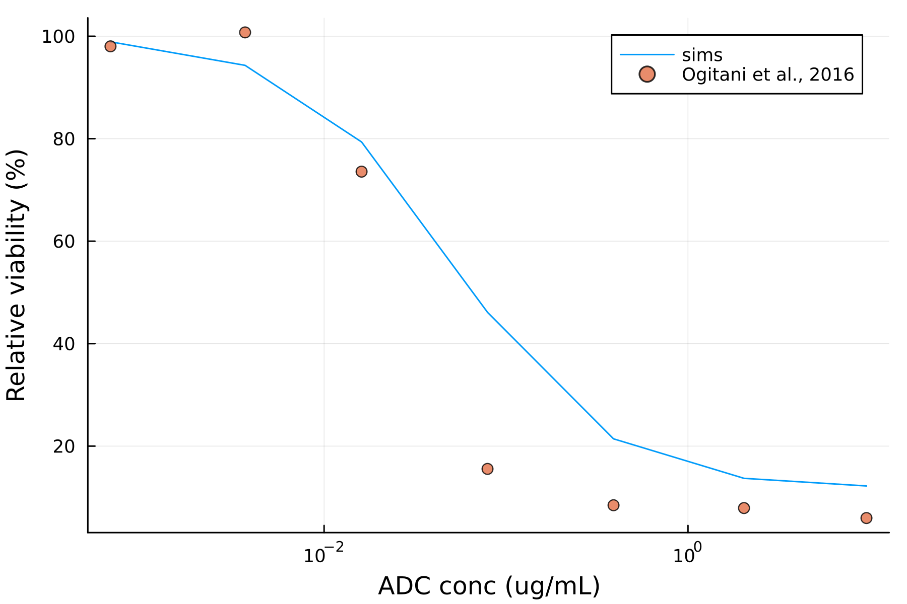
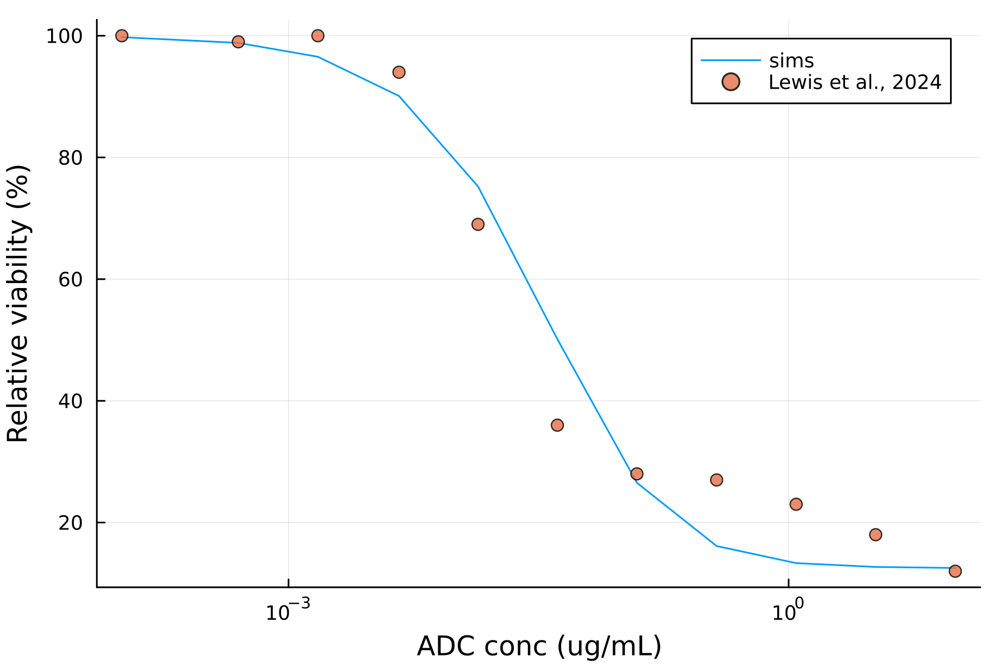
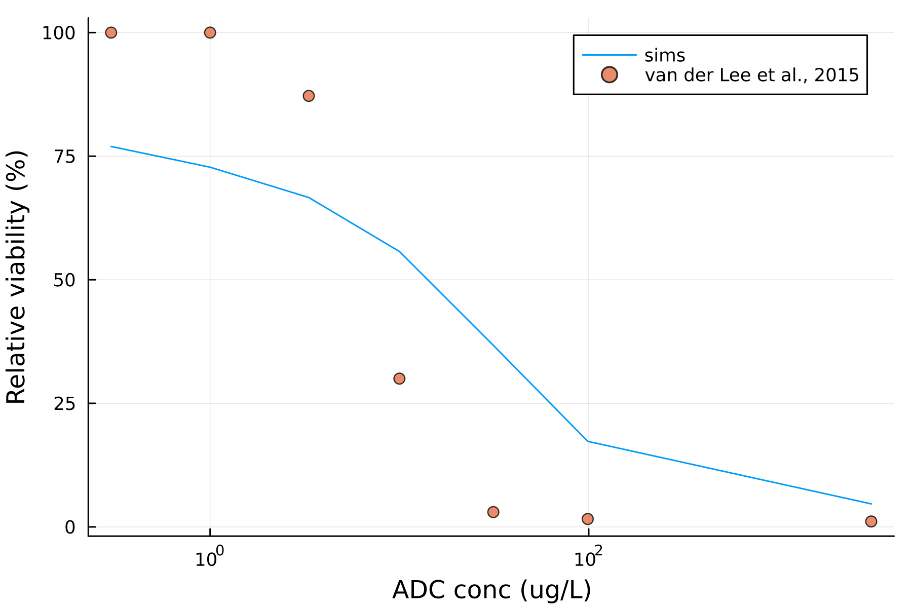

# ADC toxicity 

The following ADCs were included in this study 

| ADC | mAb | Linker | Payload | Bystander effect | DLT | Status | 
| --- | --- | ------ | ------- | ---------------- | --- | ------ |
| T-DM1 | trastuzumab | uncleavable MCC linker | DM1 | No | TCP | Approved |
| T-Dxd | trastuzumab | cleavable tetrapeptide linker | Dxd | Yes | N.A. Reported toxicity events include grade 3 decrease in lymphocytes, neutrophils, and 1 case for grade 4 anemia ([Toi et al., 2017](https://pubmed.ncbi.nlm.nih.gov/29037983/)) | Approved | 
| DHES0815A | hu7C2 | hindered disulfide linker | PBD-monoamide | Yes | N.A. | Discontinued due to persistent safety findings |
| SYD985 | trastuzumab | cleavable vc linker | duocarmycin | Yes | Pneumonitis ([Banerji et al., 2019](https://pubmed.ncbi.nlm.nih.gov/31257177/))  | Discontinued (unspecified reason) |

Source of parameters: 
- HER2 dynamics: [Scheuher et al., 2023](https://link.springer.com/article/10.1007/s10928-023-09884-6)

Source data: 
- DHES0815A: [Lewis et al., 2024](https://www.nature.com/articles/s41467-023-44533-z)
- SYD985: [van der Lee et al., 2015](https://pubmed.ncbi.nlm.nih.gov/25589493/)

 <table>
  <tr>
    <td>T-DM1 in vitro cytotoxicity</td>
    <td>T-Dxd in vitro cytotoxicity</td>
  </tr>
  <tr>
    <td></td>
    <td></td>
  </tr>
  <tr>
    <td>DHES0815A in vitro cytotoxicity</td>
    <td>SYD985 in vitro cytotoxicity</td>
  </tr>
  <tr>
    <td></td>
    <td></td>
  </tr>
 </table>

