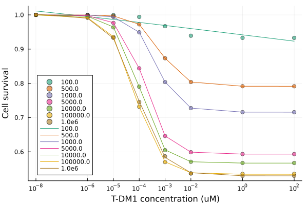

# ADC-toxicity-2024

## HER expression level across cell lines

https://aacrjournals.org/mct/article/19/9/1822/92964/Nonclinical-Development-of-Next-generation-Site
https://pubmed.ncbi.nlm.nih.gov/34532543/
https://pubmed.ncbi.nlm.nih.gov/26766593/

 ### Link between HER2 expression and ADC IC50 

 How HER2 expression on a cell line could impact the IC50 observed in in vitro experiments is explored here. T-DM1 was used as an example. 

 The T-DM1 IC50 estimated from different hyperthetical HER2-expressing cell line were listed as below. 

 | HER2 copies per cell | 1E2 | 5E2 | 1E3 | 5E3 | 1E4 | 1E5 | 1E6 | 
 | -------------------- | --- | --- | --- | --- | --- | --- | --- |  
 | Estimated IC50 (uM) | 1.9 | 6.5E-4 | 4.5E-4 | 1.5E-4 | 1.1E-4 | 7.1E-5 | 8.2E-5 | 

 The goodness-of-fit is shown below.

 <figure class="image">
  
  <figcaption></figcaption>
</figure>

 ## Explore Trop2-targeting ADC

| ADC | mAb | Linker | Payload | Bystander effect | DLT | MTD | Status | 
| --- | --- | ------ | ------- | ---------------- | --- | --- | ------ |
| Dato-Dxd | Datopotamab | tetrapeptide-based cleavable linkers | Dxd (a derivative of SN-38) | Yes | grade 3 stomatitis, grade 3 mucosal inflammation, grade 3 rash maculopapular ([Shimizu et al., 2023](https://www.ncbi.nlm.nih.gov/pmc/articles/PMC10564307/)) | 8 mg/kg ([Shimizu et al., 2023](https://www.ncbi.nlm.nih.gov/pmc/articles/PMC10564307/)) | Application in progress |
| SG | hRS7 | hydrolysable CL2A linker | SN-38 (topoisomerase I inhibitor) | Yes | neutropenia, diarrhoea ([Syed, 2020](https://link.springer.com/article/10.1007/s40265-020-01337-5)) | 12 mg/kg ([Starodub et al., 2015](https://www.ncbi.nlm.nih.gov/pmc/articles/PMC4558321/)) | Approved |

The TROP-2 dynamics was optimized based on Dato-Dxd data (Figure 6A). The cytotoxicity parameters for Dxd was inherited from [Scheuher et al., 2023](https://link.springer.com/article/10.1007/s10928-023-09884-6) and was reasonable to capture Dxd release reported in [Okajima et al., 2021](https://aacrjournals.org/mct/article/20/12/2329/675152/Datopotamab-Deruxtecan-a-Novel-TROP2-directed) (Figure 6b). 

Due to the easy-to-deconjugate nature of SG ([Cardillo et al., 2015](https://pubs.acs.org/doi/10.1021/acs.bioconjchem.5b00223)), the optimization of SG focused on directly using cytotoxicity data on the payload, SN-38, obtained from [Cheng et al., 2022](https://www.frontiersin.org/journals/oncology/articles/10.3389/fonc.2022.951589/full).

  <table>
  <tr>
    <td></td>
    <td></td>
    <td></td>
  </tr>
  <tr>
    <td>Figure 6A. TROP-2 dynamics based on Dato-Dxd in vitro data.</td>
    <td>Figure 6B. Dxd release in Dato-Dxd treated cells.</td>
    <td>Figure 6C. In vitro cytotoxicity of SG payload, SN38.</td>
  </tr>
 </table>
