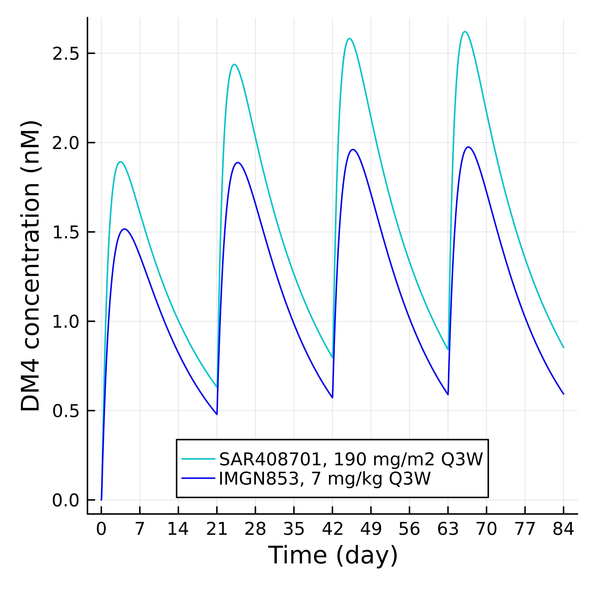

## DM4 exposure was less sensitive towards PK in ADCs with DM4 payload, but DM4 exposure in liver endothelial cells might still drive liver tox  

To further investigate if the observations of DM1 payload still holds in payload with better diffusivity, we look into ADCs with DM4 payload. Both DM1 and DM4 are maytansinoids, but DM4 was reported to have better diffusivity and bystander effect (<a href = https://pubmed.ncbi.nlm.nih.gov/16618769/>Erickson et al., 2006</a>, <a href = https://pubmed.ncbi.nlm.nih.gov/25904506/>Ab et al., 2017</a>). Two drugs that were included in the study was listed in Table 7 and PK fitting in Figure 6. 

Model-predicted plasma ADC concentrations at 170 mg/m2 Q3W were different (Figure 7A), with IMGN853 has faster clearance from plasma. However, the predicted DM4 profile in liver endothelial cells were close (Figure 7B). This is presumably due to the diffusivity of DM4. Once released into the cytosol after ADC degradation, these payload molecules can diffuse into either tissue interstitium or vasculature, instead of trapped inside cells. 

By lowering the payload diffusion rate to the same rate as DM1 (kout = 0.21 hr-1), an ADC with faster plasma clearance like IMGN853 was predicted to result in higher payload concentration in liver endothelial cells than an ADC with slower plasma clearance like SAR408701 (Figure 7C).

Both drug was reported to have some liver tox, though only SAR408701 was reported to have liver tox as DLT at 190 mg/m2 (<a href = https://pmc.ncbi.nlm.nih.gov/articles/PMC10461573/>Tabernero et al., 2023</a>, <a href = https://pmc.ncbi.nlm.nih.gov/articles/PMC6896318/>Moore et al., 2017</a>). This may be explained by the higher predicted DM4 concentration in the liver endothelial cells (Figure 7D). The average DM4 concentration from SAR408701 was predicted to be ~30% higher than IMGN853 (Table 8). This increase in average DM4 concentration is roughly in line with increased of DM4 in the total ADC dosed. 

 <table>
  <tr>Table 7. ADCs with DM4 payload used in this study. </tr>
    <tr>
      <th>ADC</th>
      <th>DLT</th>
      <th>MTD</th>
      <th>Status</th>
  </tr>
  <tr>
      <td>Tusamitamab ravtansine (SAR408701)</td>
      <td>keratopathy, Grade 3 transaminitis at 190 mg/m2 Q3W (<a href = https://pmc.ncbi.nlm.nih.gov/articles/PMC10461573/>Tabernero et al., 2023</a>)</td>
      <td>100 mg/m2 Q2W (<a href = https://www.sciencedirect.com/science/article/pii/S0923753422000035>Gazzah et al., 2022</a>), 170 mg/m2 Q3W (<a href = https://pmc.ncbi.nlm.nih.gov/articles/PMC10461573/>Tabernero et al., 2023</a>)</td>
      <td>Discontinued</td>
  </tr>
  <tr>
      <td>Mirvetuximab soravtansine (IMGN853)</td>
      <td>Grade 3 punctate keratitis (<a href = https://pmc.ncbi.nlm.nih.gov/articles/PMC6896318/>Moore et al., 2017</a>)</td>
      <td> >7 mg/kg (<a href = https://pmc.ncbi.nlm.nih.gov/articles/PMC6896318/>Moore et al., 2017</a>)</td>
      <td>Approved (6 mg/kg Q3W)</td>
  </tr>
 </table>

<table>
  <tr>Figure 6. Fitted plasma ADC concentration for tusamitamab ravtansine(A) and mirvetuximab soravtansine(B). </tr>
  <tr>
    <td>A. </td>
    <td>B. </td>
  </tr>
</table>

<table>
<tr>Figure 7. Predicted plasma ADC concentration (A) and DM4 concentration in liver endothelial cells when SAR408701 and IMGN853 dosed at 170 mg/m2 Q3W (B), or at 190 mg/m2 and 7 mg/kg, respectively (D). (ADD PK)</tr>
  <tr>
    <td>A. </td>
    <td>B. </td>
  </tr>
  <tr>
    <td>C. </td>
    <td>D. </td>
  </tr>
</table>

<table>
<tr>Table 8. Predicted maximum (Cmax) and average (Cavg) DM4 concentration in liver endothelial cells with IMGN853 and SAR408701 dosed with different schedules. </tr>
 <tr>
    <th>Drug</th>
    <th>Dose</th>
    <th>Total ADC dose over 12 weeks</th>
    <th>DAR</th>
    <th>Total paylod dose over 12 weeks</th>
    <th>Cmax</th>
    <th>Cavg</th>
  </tr>
  <tr>
    <td>IMGN853</td>
    <td>7 mg/kg Q3W (approved dose of IMGN853) </td>
    <td>14000 nmol</td>
    <td>3.5</td>
    <td>49000 nM</td>
    <td>1.98 nM</td>
    <td>1.19 nM</td>
  </tr>
    <tr>
    <td>SAR408701</td>
    <td>190 mg/m2 Q3W (showing DLT)</td>
    <td>17340 nmol</td>
    <td>3.8</td>
    <td>65892 nM</td>
    <td>2.63 nM</td>
    <td>1.54 nM</td>
  </tr>
</table>
