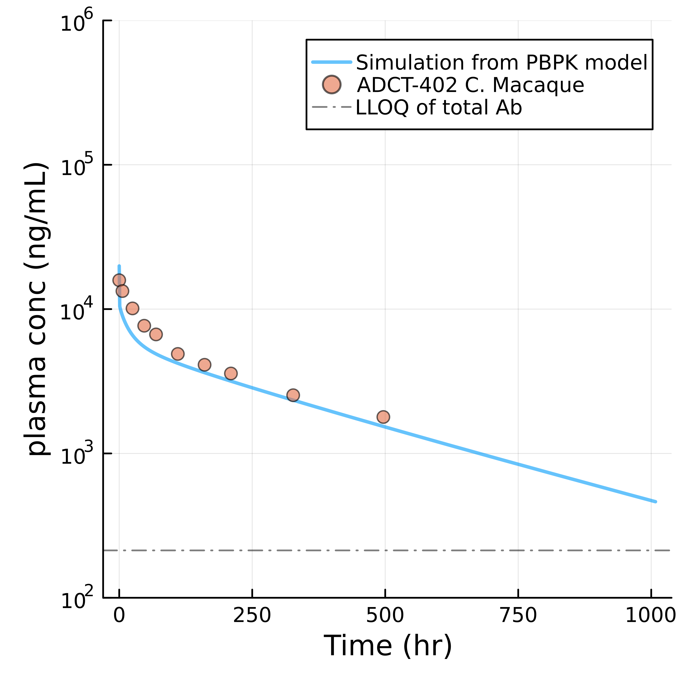
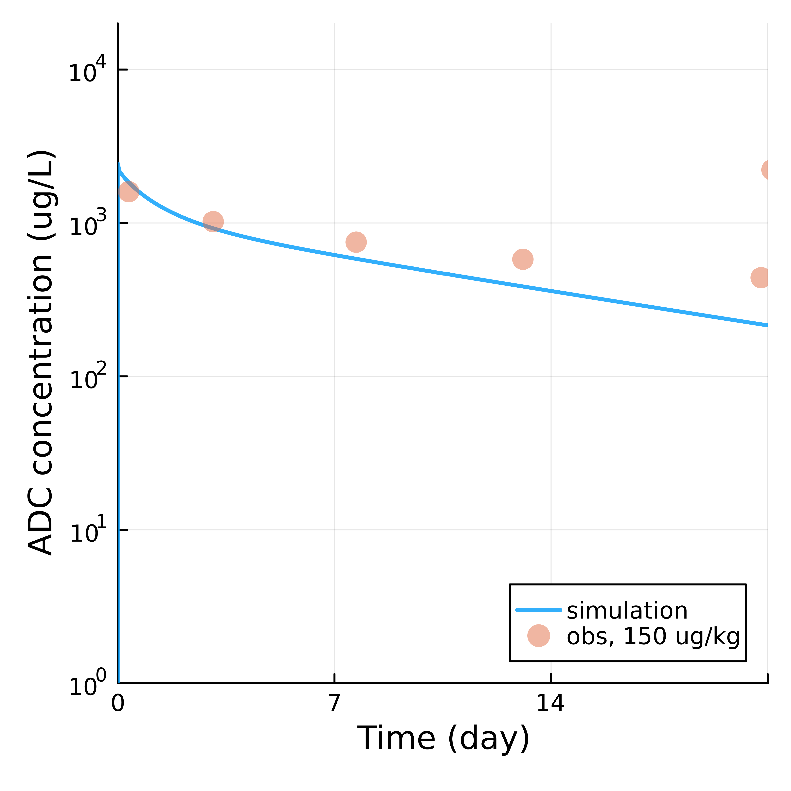
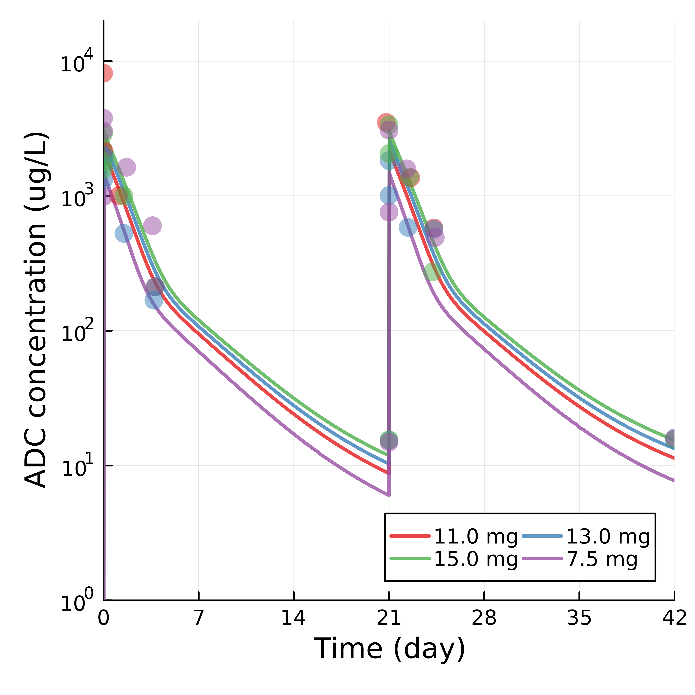
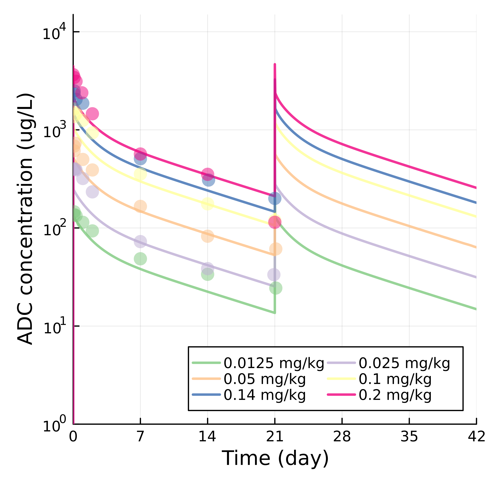
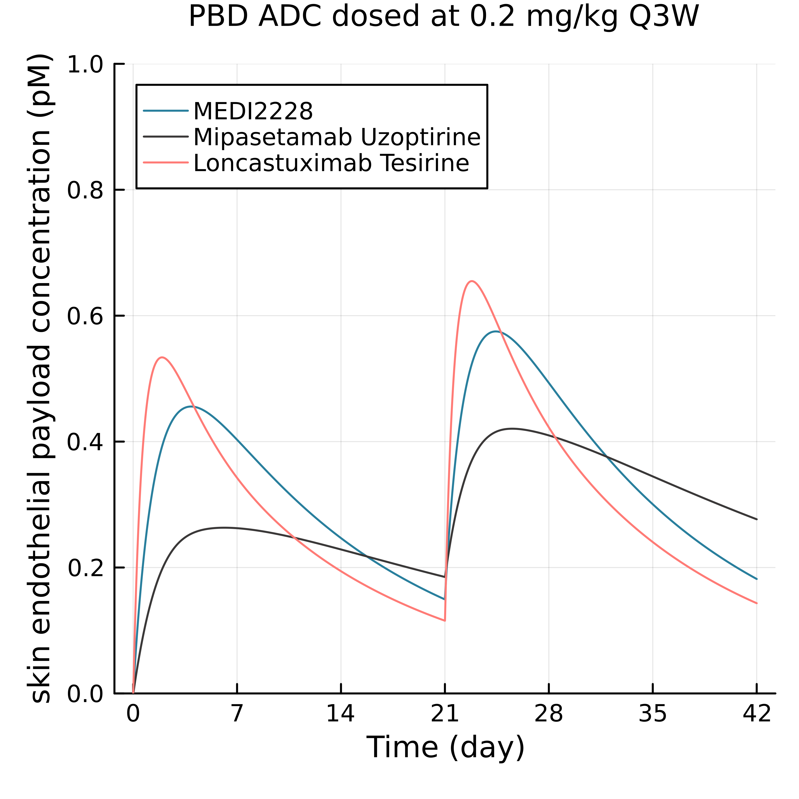
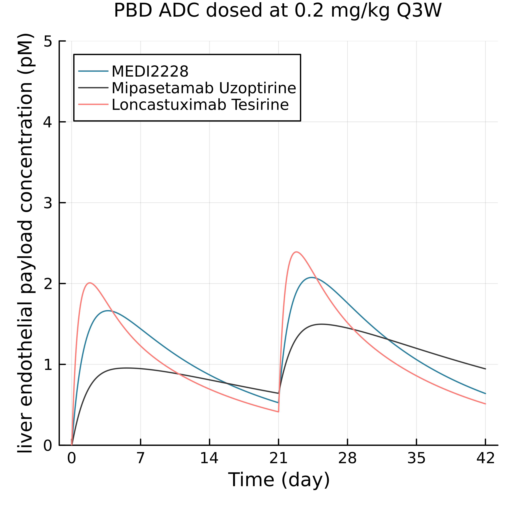

# PBD payload group 

 <table>
 <tr>Table 9. ADCs with PBD payload used in this study. </tr>
    <tr>
      <th>ADC</th>
      <th>DLT</th>
      <th>MTD</th>
      <th>Status</th>
    </tr>
 <tr>
      <td>Loncastuximab Tesirine (ADCT-402)</td>
      <td>Grade 4 thrombocytopenia, grade 3 febrile neutropenia (<a href = https://pmc.ncbi.nlm.nih.gov/articles/PMC8138546/>Hamadani et al., 2021</a>)</td>
      <td> > 200 ug/kg (MTD not reached in <a href = https://pmc.ncbi.nlm.nih.gov/articles/PMC8138546/>Hamadani et al., 2021</a>)</td>
      <td>Approved</td>
  </tr>
  <tr>
      <td>Mipasetamab Uzoptirine (ADCT-601)</td>
      <td>Cheilitis grade 2 and grade 3 (<a href = https://www.adctmedical.com/wp-content/uploads/2024/04/AACR-2024_Van-Tine_ADCT-601-102-dose-esc-STS_poster_FINAL_crtd-1.pdf>Van Tine et al., 2024</a>)</td>
      <td>Not reached, by DLT shown at 13mg and 15mg Q3W (<a href = https://www.adctmedical.com/wp-content/uploads/2024/04/AACR-2024_Van-Tine_ADCT-601-102-dose-esc-STS_poster_FINAL_crtd-1.pdf>Van Tine et al., 2024</a>)</td>
      <td>Discontinued</td>
  </tr>
  <tr>
      <td>MEDI2228</td>
      <td>Grade 4 thrombocytopenia</td>
      <td>0.14 mg/kg Q3W (<a href = https://ashpublications.org/blood/article/136/Supplement%201/26/469902/Phase-1-First-in-Human-Study-of-MEDI2228-a-BCMA>Kumar et al., 2020</a>)</td>
      <td>Discontinued</td>
  </tr>
 </table>

<table>
  <tr>Figure 9. PK fitted for loncastuximab tesirine on C. Marcaque (A), human (B), mipasetamab uzoptirine on human (C), and MEDI2228 on human (D).  </tr>
  <tr>
    <th>A. ADCT-402 cyno PK</th>
    <th>B. ADCT-402 homo PK</th>
    <th>C. ADCT-601 homo PK</th>
    <th>D. MEDI2228 homo PK</th>
  </tr>
  <tr>
    <td></td>
    <td></td>
    <td></td>
    <td></td>
  </tr>
 </table>

<table>
  <tr>Figure 10. Predicted PBD concentration in skin (A) and liver (B) endothelial cells. </tr>
  <tr>
    <th>A. Predicted PBD concentration in skin endothelial cells. </th>
    <th>B. Predicted PBD concentration in liver endothelial cells. </th>
  </tr>
  <tr>
    <td></td>
    <td></td>
  </tr>
 </table>

<table>
  <tr>Table 10. </tr>
  <tr>
    <td> Drug </td>
    <td> Dose </td>
    <td> Organ </td>
    <td> Cmax </td>
    <td> Ctrough </td>
    <td> Cavg </td>
  </tr>
  <tr>
    <td> Loncastuximab Tesirine </td>
    <td> 200 ug/kg </td>
    <td> Liver </td>
    <td> 2.39 pM </td>
    <td> 0.51 pM </td>
    <td> 1.13 pM </td>
  </tr>
  <tr>
    <td> Mipasetamab Uzoptirine </td>
    <td> 15 mg (equivalent of 200 ug/kg) </td>
    <td> Liver </td>
    <td> 1.50 pM </td>
    <td> 0.94 pM </td>
    <td> 1.02 pM </td>
  </tr>
  <tr>
    <td> MEDI2228 </td>
    <td> 0.2 mg/kg </td>
    <td> Liver </td>
    <td> 2.07 pM </td>
    <td> 0.639 pM </td>
    <td> 1.20 pM </td>
  </tr>
</table>