# Background 

Physiologically-based pharmacokinetics (PBPK) models have been developed to capture distribution of monoclonal antibodies, with their biodistribution carefully analyzed ([Shah and Betts, 2012](https://pubmed.ncbi.nlm.nih.gov/22143261/), [Jones et al., 2019](https://pubmed.ncbi.nlm.nih.gov/31464379/)). These models have been applied to antibody-drug conjugates (ADCs), which pharmacokinetics (PK) are driven by the monoclonal antibodies (e.g., [Caimi et al., 2024](https://pubmed.ncbi.nlm.nih.gov/38406517/)). However, many of these models focused on the ADC distribution towards tumor, while underexplored the model’s ability to predict ADC and payload dynamics in non-tumoral tissues. 

In this study, we aimed to use the PBPK model to explore ADC biodistribution and payload dynamics in healthy tissue, with a focus on liver. We especially aim to explore payload concentration in liver endothelial cells, and aim to potentially explain toxicities observed in clinical studies. 

# Method 

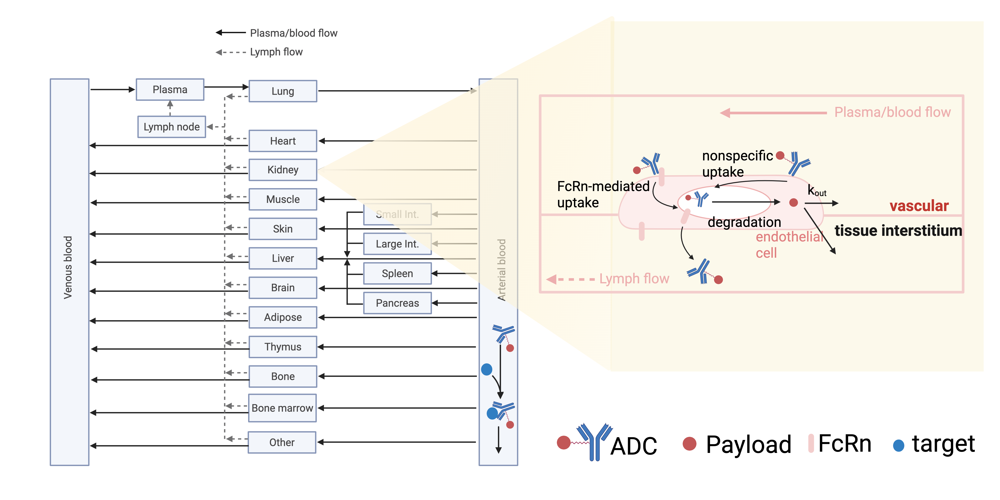

- PBPK backbone from [Jones et al., 2019](https://pubmed.ncbi.nlm.nih.gov/31464379/)
- ADC dynamics after being taken up by endothelial cells 
    - ADC uptake by endothelial cells were driven by either FcRn or nonspecific uptake 
    - 99% ADC bound to FcRn were recycled into the system; 1% were routed for degradation 
    - 95% of ADC entering endothelial cells through nonspecific uptake were routed for degradation 
    - Payload is released into endothelial cells after ADC is degraded
    - Payload is not degraded in the cytotol in endothelial cells
    - Payload in endothelial cells could further diffuse into either vasculature or tissue interstitial space
    - Payload in tissue interstitium has a fixed half life (~ 0.78 hr ([Scheuher et al., 2024](https://pubmed.ncbi.nlm.nih.gov/37787918/)))

Payload in endothelial cytosol were explored in correlation to reported toxicity (either driven by Cmax or Cavg). 

# ADCs included in this study 

<table>
  <tr>
    <th> ADC </th>
    <th> Payload </th>
    <th> DAR </th>
    <th> kout (1/hr) </th>
    <th> Diffusion Half Life (min) </th>
  </tr>
  <tr>
    <td> trastuzumab emtansine (T-DM1) </td>
    <td> DM1 </td>
    <td> 3.5 (<a href = "https://pubmed.ncbi.nlm.nih.gov/37787918/">Scheuher et al., 2024</a>) </td>
    <td> 0.14  (<a href = "https://pubmed.ncbi.nlm.nih.gov/37787918/">Scheuher et al., 2024</a>) </td>
    <td> 297.06 </td>
  </tr>
  <tr>
    <td> trastuzumab deruxtecan (T-Dxd) </td>
    <td> Dxd </td>
    <td> 8 (<a href = "https://pubmed.ncbi.nlm.nih.gov/37787918/">Scheuher et al., 2024</a>) </td>
    <td> 32.32 (<a href = "https://pubmed.ncbi.nlm.nih.gov/37787918/">Scheuher et al., 2024</a>, <a href="https://pubmed.ncbi.nlm.nih.gov/33803327/">Conilh et al., 2021</a>) </td>
    <td> 1.29 </td>
  </tr>
  <tr>
    <td> cantuzumab mertansine </td>
    <td> DM1 </td>
    <td> 3.5 (<a href = "https://pubmed.ncbi.nlm.nih.gov/18301896/">Rodon et al., 2008</a>) </td>
    <td> 0.14  (<a href = "https://pubmed.ncbi.nlm.nih.gov/37787918/">Scheuher et al., 2024</a>) </td>
    <td> 297.06 </td>
  </tr>
  <tr>
    <td> brentuximab vedotin </td>
    <td> MMAE </td>
    <td> 4.4 (<a href = "https://pubmed.ncbi.nlm.nih.gov/23151991/">Shah and Betts, 2012</a>) </td>
    <td> 2 (<a href = "https://pubmed.ncbi.nlm.nih.gov/30832603/">Byun and Jung, 2019</a>) </td>
    <td> 20.79 </td>
  </tr>
  <tr>
    <td> polatuzumab vedotin </td>
    <td> MMAE </td>
    <td> 3.5 (<a href = "https://pmc.ncbi.nlm.nih.gov/articles/PMC8004598/">Yip et al., 2021</a>) </td>
    <td> 2 (<a href = "https://pubmed.ncbi.nlm.nih.gov/30832603/">Byun and Jung, 2019</a>) </td>
    <td> 20.79 </td>
  </tr>
</table>

# Figures 

## 1. PK fit 

<table>
  <tr>
    <td>A. 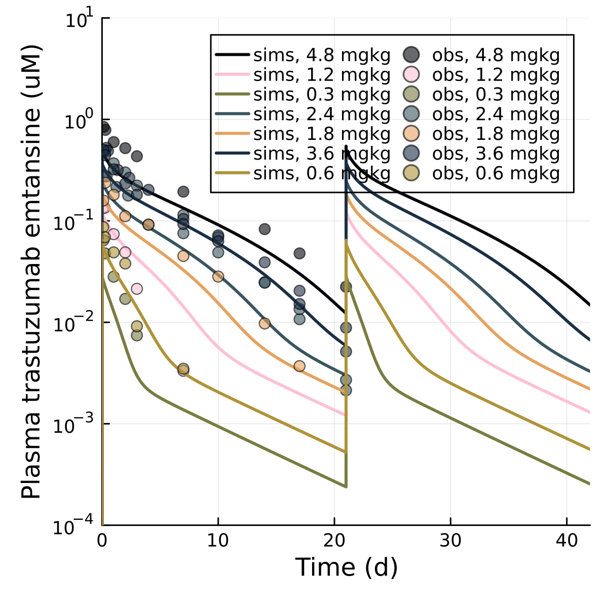</td>
    <td>B. 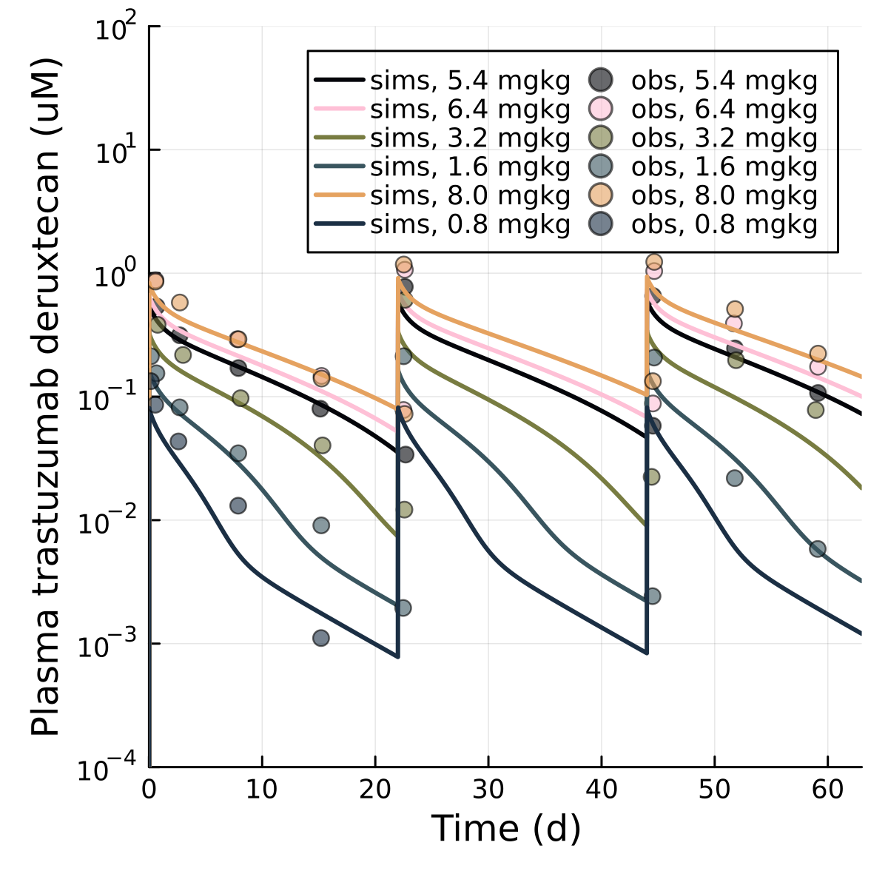</td>
  </tr>
    <td colspan="2">C. 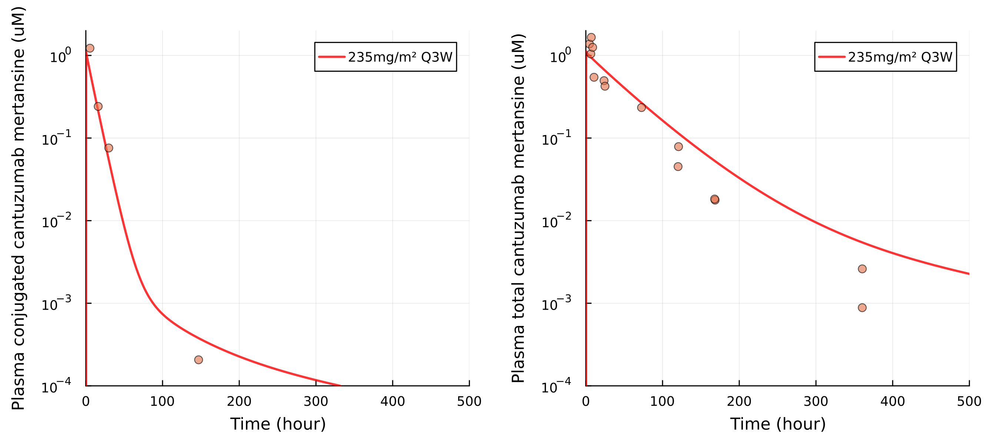</td>
  <tr>
  </tr>
  <tr>
    <td>D. 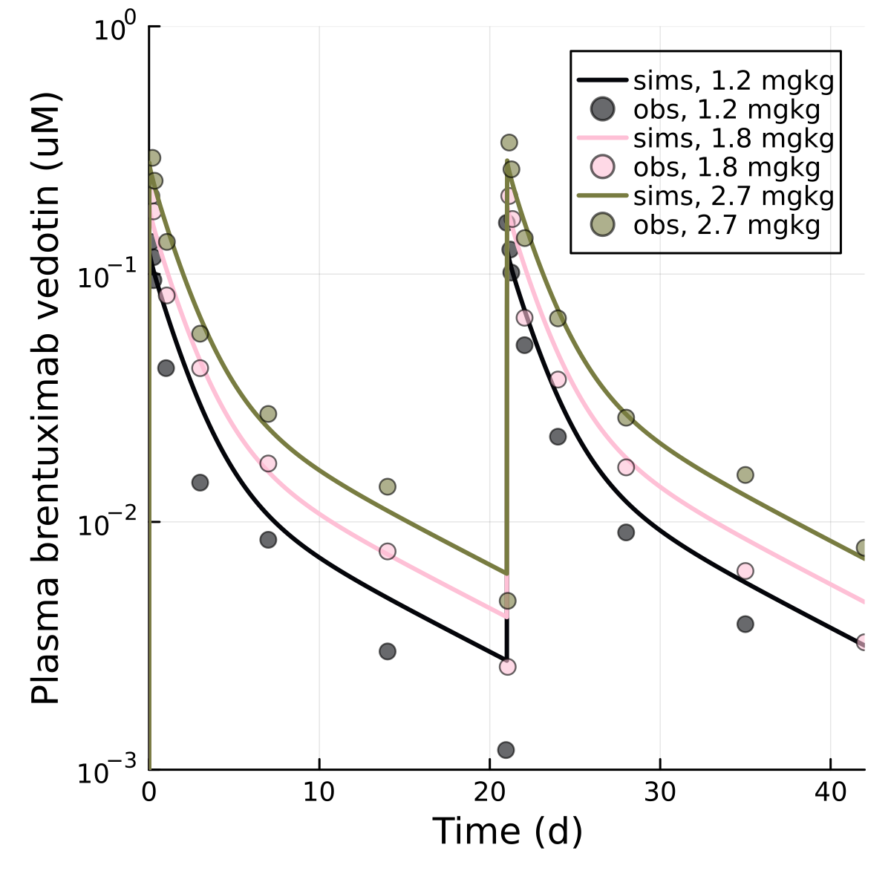</td>
    <td>E. 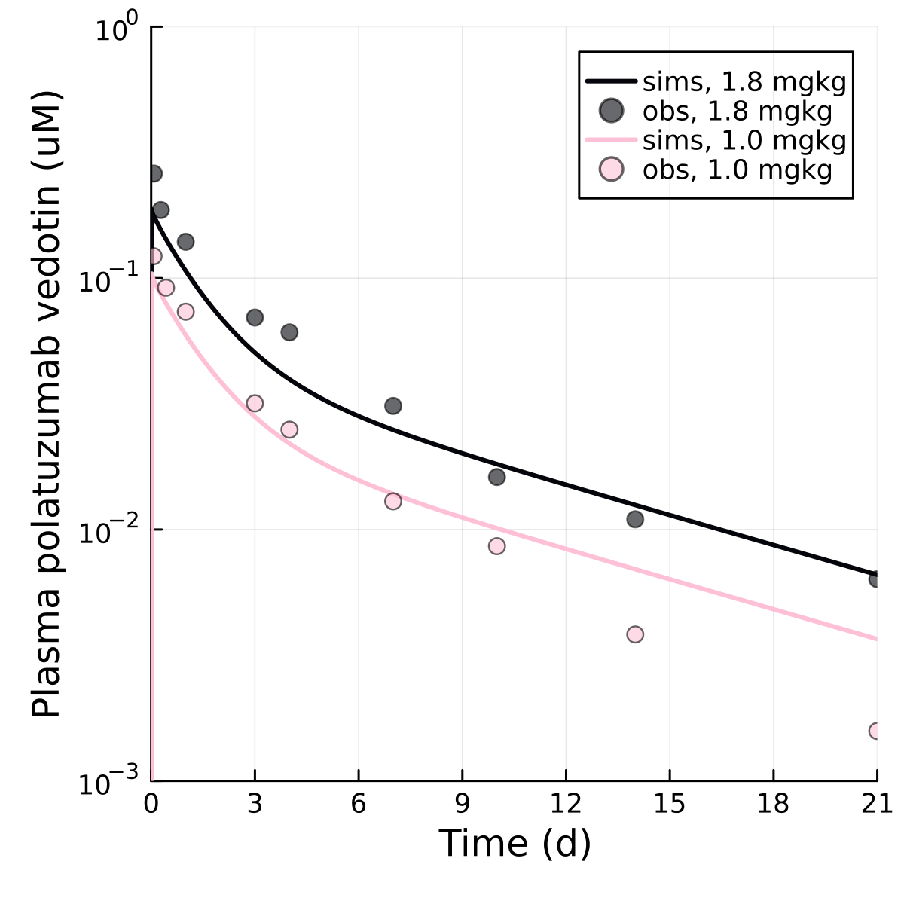</td>
    <td> </td>
  </tr>
</table>

## 2. Most of ADCs that distributed in the system ended up in liver, despite spleen was predicted to have higher peak ADC concentration

<table>
  <tr>
    <td> 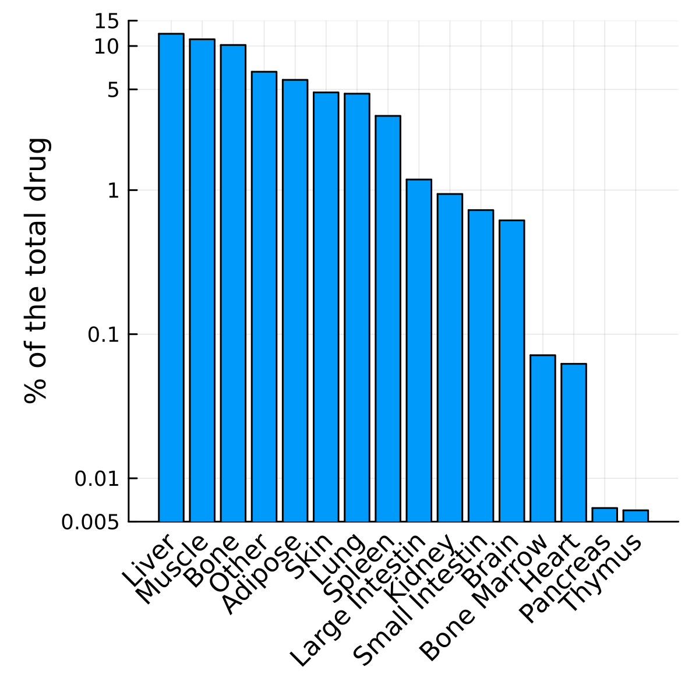 </td>
    <td> 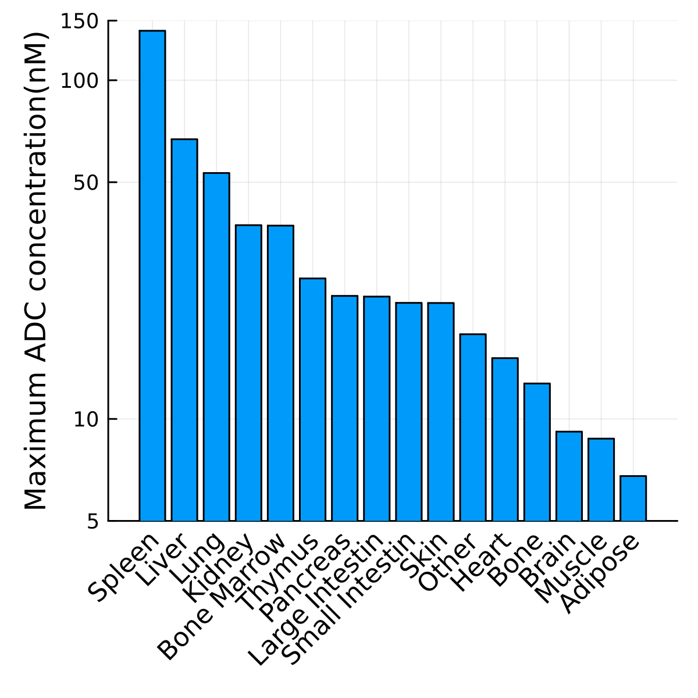 </td>
  </tr>
</table> 

## 3. Concentration of free payload in liver endothelial cells correlates with liver toxicity 

<table>
    <tr>
        <th> ADC </th>
        <th> Payload </th>
        <th> Dose </th>
        <th> Cmax, free payload, liver endothelial cells </th>
        <th> Cavg, free payload, liver endothelial cells </th>
        <th> Payload IC50 </th>
    </tr>
    <tr>
        <td> T-DM1 </td>
        <td> DM1 </td>
        <td> 3.6 mg/kg Q3W </td>
        <td> 7.21 nM </td>
        <td> 3.01 nM </td>
        <td> 0.03 - 0.1 nM (<a href = https://pubmed.ncbi.nlm.nih.gov/24967516/>Lambert and Chari, 2014</a>) </td>
    </tr>
    <tr>
        <td> T-Dxd </td>
        <td> Dxd </td>
        <td> 5.4 mg/kg Q3W </td>
        <td> 0.16 nM </td>
        <td> 0.0719 nM </td>
        <td> 0.311 - 1.09 nM (<a href = https://pubmed.ncbi.nlm.nih.gov/35149548/>Yamato et al., 2022</a>) </td>
    </tr>
    <tr>
        <td> Cantuzumab mertansine </td>
        <td> DM1 </td>
        <td> 235 mg/m2 Q3W </td>
        <td> 37 nM </td>
        <td> 22.4 nM </td>
        <td> 0.03 - 0.1 nM (<a href = https://pubmed.ncbi.nlm.nih.gov/24967516/>Lambert and Chari, 2014</a>) </td>
    </tr>
    <tr>
        <td> Cantuzumab mertansine </td>
        <td> DM1 </td>
        <td> 115 mg/m2 QW </td>
        <td> 37.9 nM </td>
        <td> 30.7 nM </td>
        <td> 0.03 - 0.1 nM (<a href = https://pubmed.ncbi.nlm.nih.gov/24967516/>Lambert and Chari, 2014</a>) </td>
    </tr>
    <tr>
        <td> Cantuzumab mertansine </td>
        <td> DM1 </td>
        <td> 45 mg/m2, 3 times a week, 3 out of 4 weeks </td>
        <td> 38.4 nM </td>
        <td> 27.8 nM </td>
        <td> 0.03 - 0.1 nM (<a href = https://pubmed.ncbi.nlm.nih.gov/24967516/>Lambert and Chari, 2014</a>) </td>
    </tr>
    <tr>
        <td> brentuximab vedotin </td>
        <td> MMAE </td>
        <td> 1.8 mg/kg Q3W </td>
        <td> 0.686 nM </td>
        <td> 0.421 nM </td>
        <td> 0.87 - 1.65 nM (<a href = https://pubmed.ncbi.nlm.nih.gov/25704403/>Koga et al., 2015</a>) </td>
    </tr>
    <tr>
        <td> polatuzumab vedotin </td>
        <td> MMAE </td>
        <td> 1.8 mg/kg Q3W </td>
        <td> 0.569 nM </td>
        <td> 0.352 nM </td>
        <td> 0.87 - 1.65 nM (<a href = https://pubmed.ncbi.nlm.nih.gov/25704403/>Koga et al., 2015</a>) </td>
    </tr>
</table>

Lower diffusion rate of payload in T-DM1 drove the high concentration of free payload in endothelial cells, despite higher dose in T-Dxd and its higher DAR. 

<table>
  <tr>
    <td> Figure ?A. Predicted free payload concentration in liver endothelial cells betwee T-DM1 and T-Dxd with their corresponding approved dosing scheme (3.6 mg/kg Q3W and 5.4 mg/kg Q3W, respectively) over 4 cycles. </td>
    <td> Figure ?B. Predicted maximum free payload concentration of a hypothetical trastuzumab-drug conjugate at 3.6 mg/kg Q3W with DAR of 3.5 over 4 cycles. </td>
  </tr>
  <tr>
    <td> 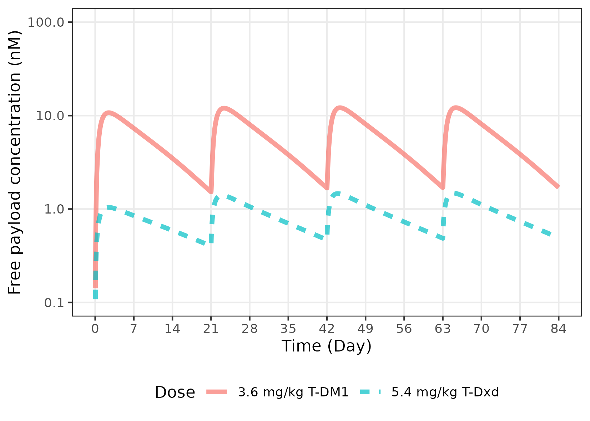 </td>
    <td> 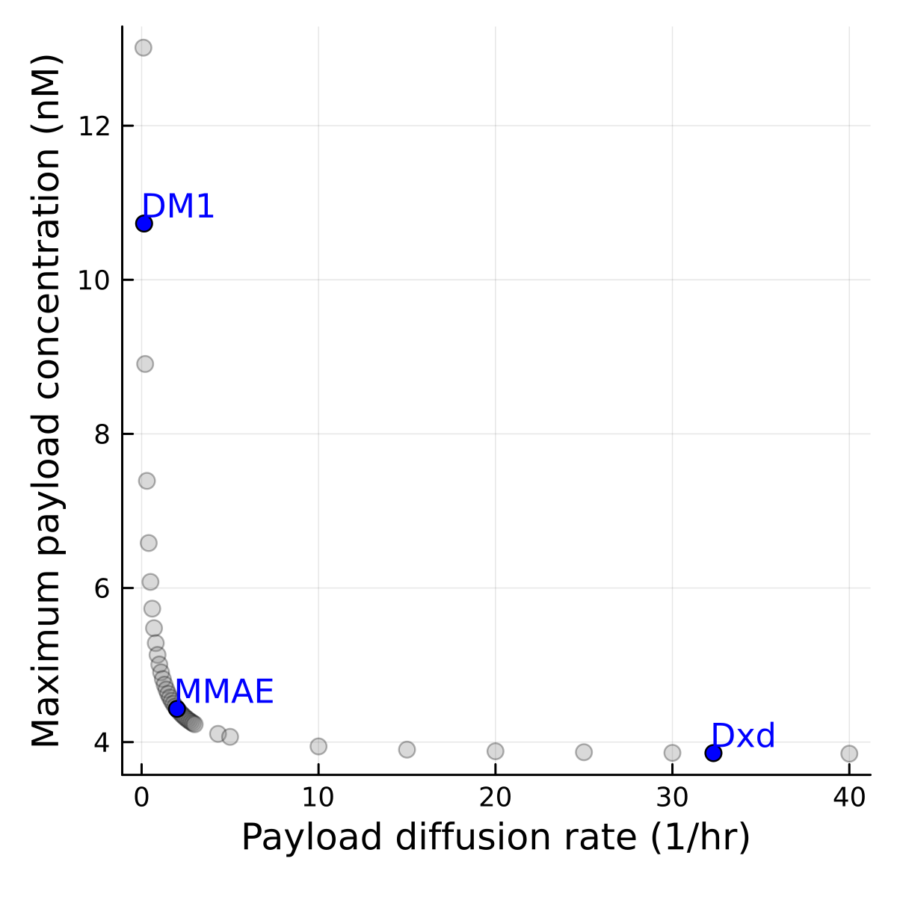 </td>
  </tr>
</table>

Dose fractionation of cantuzumab mertansine did not change peak free DM1 concentration over 12 weeks (due to DM1 accumulation in liver endothelial cells). 

The difference between trastuzumab emtansine and cantuzumab mertansine were driven by PK difference. 

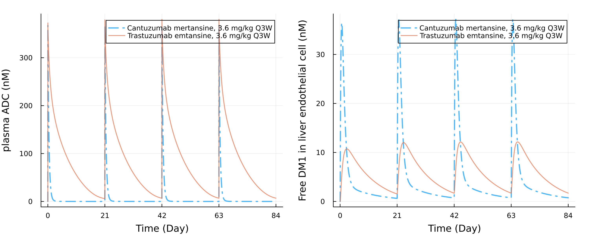

<table>
<tr>Table ??. Predicted maximum (Cmax) and average (Cavg) DM1 concentration in liver endothelial cells. </tr>
  <tr>
    <th>Drug</th>
    <th>Dose</th>
    <th>DAR</th>
    <th>Cmax</th>
    <th>Cavg</th>
  </tr>
  <tr>
    <td>Cantuzumab mertansine</td>
    <td>3.6 mg/kg Q3W</td>
    <td>3.5</td>
    <td>12.13 nM</td>
    <td>7.50 nM</td>
  </tr>
  <tr>
    <td>T-DM1</td>
    <td>3.6 mg/kg Q3W</td>
    <td>3.5</td>
    <td>7.21 nM</td>
    <td>3.00 nM</td>
  </tr>
</table>

## 4. Distribution of degraded payload in tissue endothelial cells through nonspecific uptake more than those through FcRn-mediated uptake

<table>
  <tr> Distribution of degraded payload in tissue endothelial cells through nonspecific uptake (left) and through FcRn-mediated uptake (right) </tr>
  <tr>
    <td> 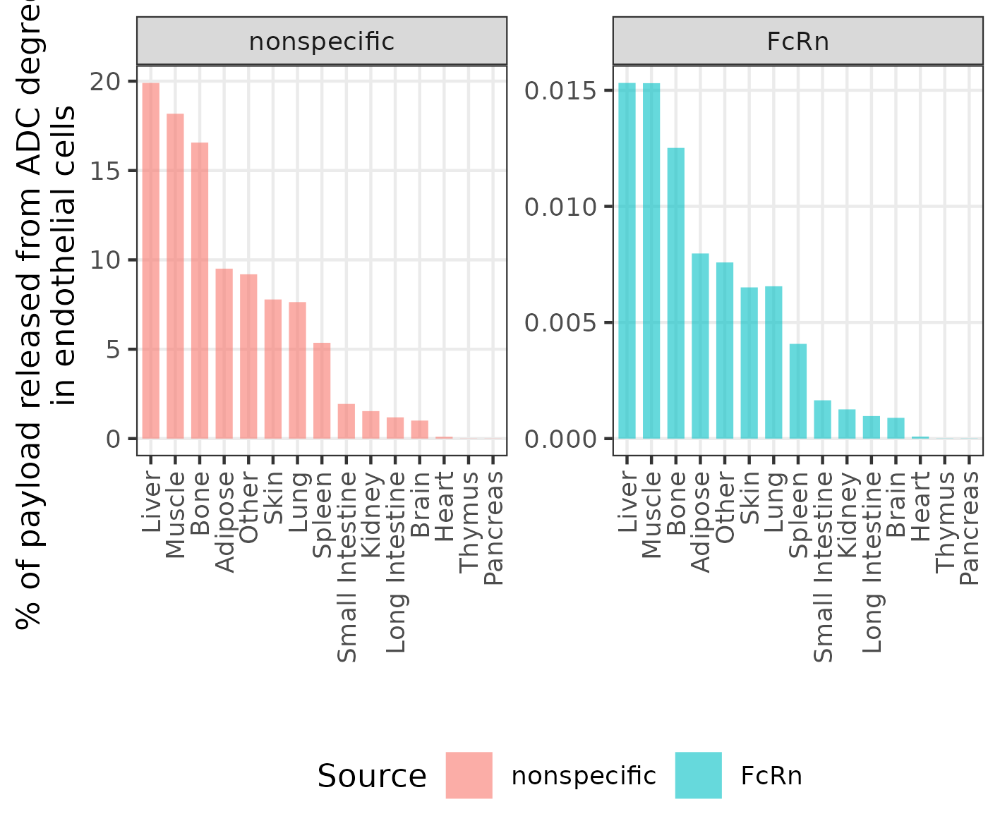 </td>
  </tr>
</table>

## 5. Affinity towards nonspecific uptake was the key factor that influenced the maximum, average concentration of free payload in liver endothelial cells, as well as ADC’s plasma half life 

<table>
  <tr> Predicted maximum (A) and average (B) payload concentration in liver endothelial cells and ADC plasma half life (C) v.s. dissociation constant (KD) towards FcRn and membrane. </tr>
  <tr>
    <td>A. 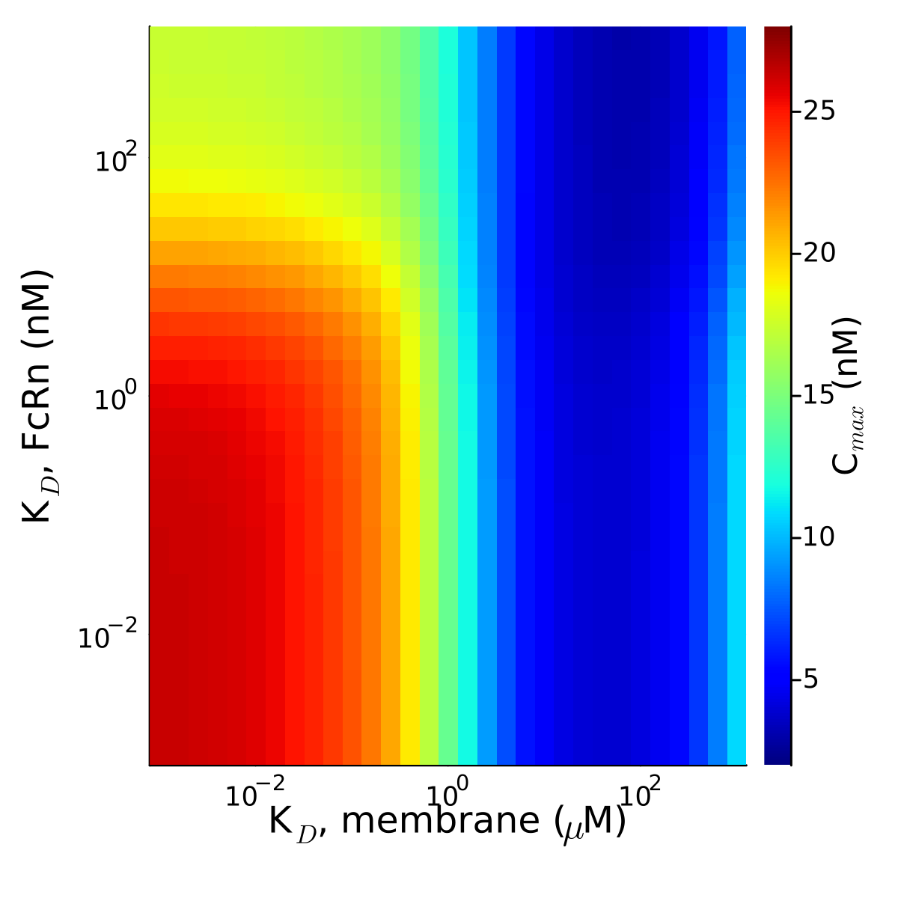</td>
    <td>B. 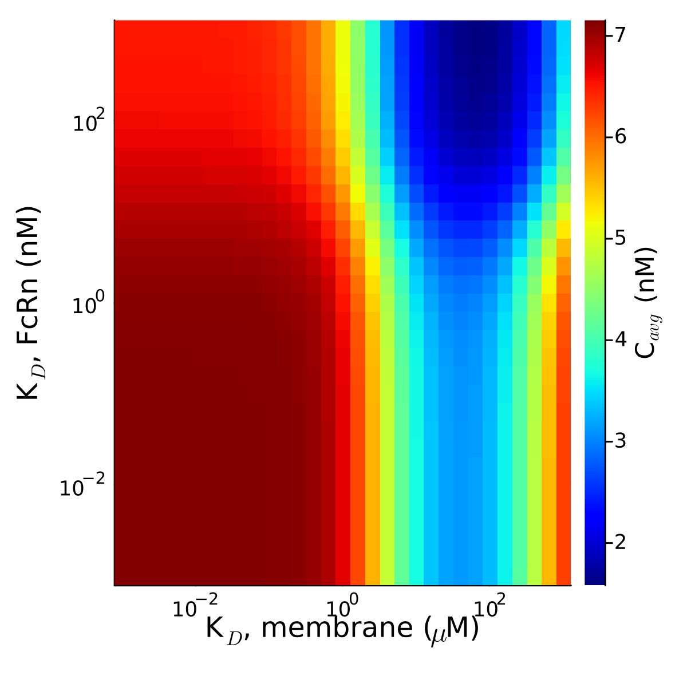</td>
    <td>C. 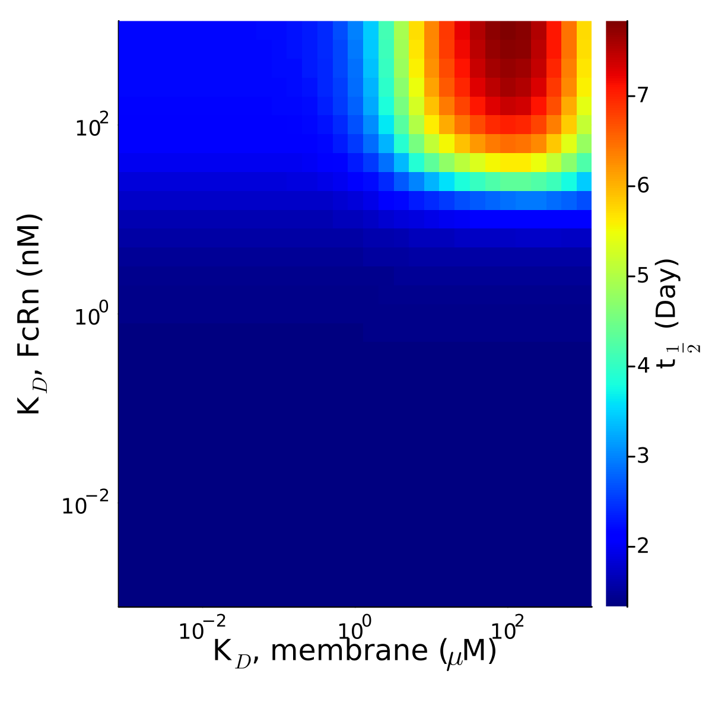</td>
  </tr>
</table>

# Software 

Modeling and simulation was carried out under Julia 1.7.2, R 4.1.3, and on metworx-22-09.00.03. 
