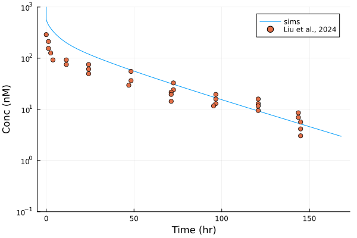
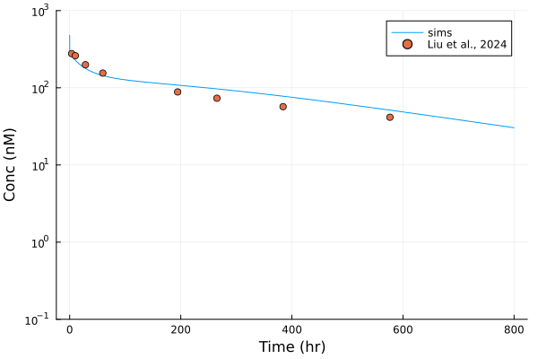

# Implement PBPK model of albumin 

Model was published in Liu et al, J Pharmacokinet. Pharmacodyn, 2024.

What's new about this model: albumin penetrate tissue, modelled using two-pore theory; in addition, albumin also have extended half life following FcRn-mediated recycline 

# Verification 

The model verification was carried out in mouse and human 

<table>
    <tr>
        <th> Figure 1A. Plasma PK of albumin, mouse </th>
        <th> Figure 1B. Plasma PK of albumin, human </th>
    </tr>
    <tr>
        <td>  </td>
        <td>  </td> 
    </tr>
</table>
